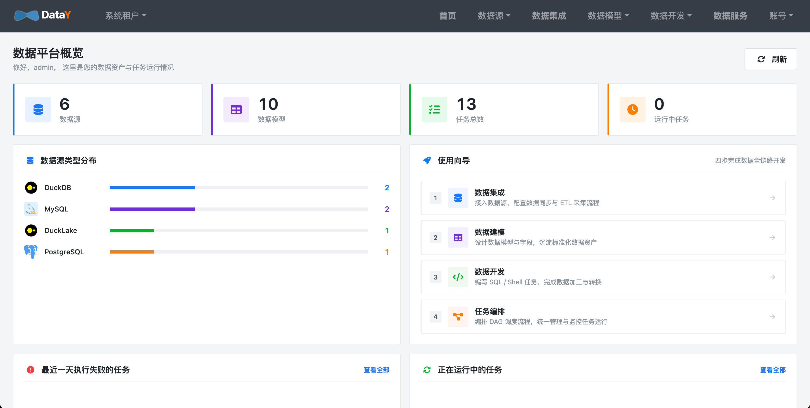
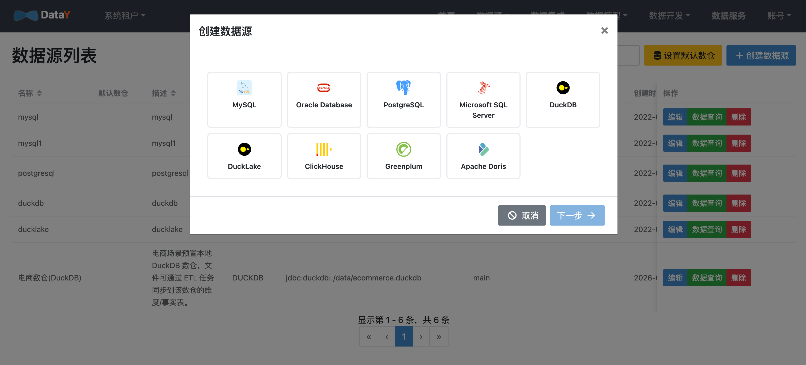
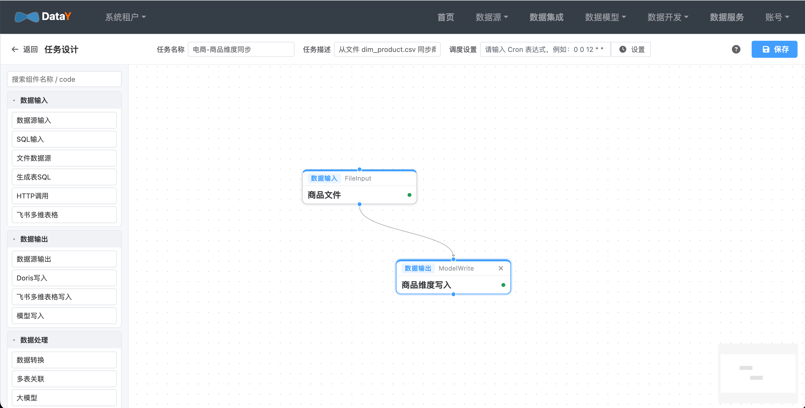
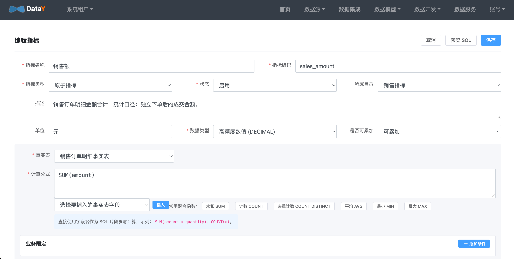

# DataY · 轻量数据平台，2C4G 搞定全场景

> 数据平台可以很小，功能不打折。一套 DataY 跑起来，数据集成、任务调度、高性能数仓、智能问数 —— 全有。

🌐 **产品首页**: [http://datay.yuyuejia.com.cn/](http://datay.yuyuejia.com.cn/)

## 为什么是 DataY？

传统数据平台动辄十几台机器、上百 G 内存，部署复杂、运维成本高。DataY 的理念是：**用最极致的硬件利用，交付最完整的数据能力。**

| 传统方案 | DataY |
| --- | --- |
| 需要 Hadoop / Spark / Flink / ClickHouse / Doris 一整套 | 一个 JAR，内嵌 DuckDB，拒绝组件地狱 |
| 几十上百台机器起步 | **2 核 4G** 即可跑通数据集成 → 数仓 → 问数的完整链路 |
| 运维门槛高，需要专职大数据工程师 | 零依赖启动，10 分钟搭好开发环境 |

DataY 不是某个单点工具，而是覆盖数据全链路的**一体化数据平台**：

```
数据集成 ──▶ 任务调度 ──▶ 高性能数仓 ──▶ 智能问数
  ETL/CDC      Cron/DAG      DuckDB      自然语言
```

## 项目结构

DataY 分两个子模块，Core 负责引擎，Web 负责平台产品：

```
datay/
├── pom.xml          # Maven 父模块
├── datay-core/      # 轻量、高性能、流批一体的数据集成引擎
└── datay-web/       # 可视化数据平台（任务设计 + 调度 + 数仓 + 问数）
```

## 四大能力，一个平台

### 🔌 数据集成（Data Integration）

- 支持 MySQL / PostgreSQL / Oracle / Doris / ClickHouse / DuckDB 等十余种数据源
- 可视化拖拽画布编排 ETL 数据流，也可 JSON 配置文件一键跑任务
- 支持全量同步、增量同步、MySQL CDC / PostgreSQL CDC 实时同步
- 自动建表（DDL 转换），源表改字段自动同步到目标

### ⏰ 任务调度（Job Scheduler）

- Cron 定时调度，Quartz 引擎精准到秒
- DAG 工作流编排，父子任务自动拓扑排序
- 支持手动触发、暂停/恢复、失败重试
- 调度 master 与执行 worker 可分离部署，单机就能跑，集群也能扩

### 🚀 高性能数仓（High-Performance Warehouse）

- **内嵌 DuckDB**，列存 + 向量化 + 无锁并发，单机就能跑出分布式数仓的性能
- 支持 Star Schema / Snowflake 维度建模，原子指标 / 衍生指标定义
- 支持 Doris / ClickHouse 流式加载，需要大规模查询可随时外挂
- 支持 DuckLake（Iceberg 格式），低成本构建数据湖

### 🤖 智能问数（AI Data Agent）

- 自然语言 → 指标 → 维度 → 时间过滤 → 取数，**一句话拿报表**
- RAG 本地向量索引，指标口径不跑偏
- 指标管理模块统一维护业务口径，问数有依据
- 也支持 AI SQL 助手：自然语言 → 可执行 SQL


## 环境要求

- Java 17+
- Maven 3.6+
- Node 22+（构建 DataY Web 前端）

## 一键部署

```bash
# 1. 克隆仓库
git clone https://cnb.cool/yuyuejia/datay

# 2. 构建项目
cd datay
mvn clean package -DskipTests

# 3. 启动（单机模式，调度+执行合一），AI 能力需要提供 AI API Key，默认为 Deepseek 原厂Key
java -jar datay-web/target/*.jar --DATAY_AI_API_KEY=sk-xxxxxxxxx

# 4. 浏览器打开 http://localhost:8080，默认账号 admin/admin
```

在线演示地址：[http://datay-demo.yuyuejia.com.cn/](http://datay-demo.yuyuejia.com.cn/)

### 开箱即用：已预置好的电商资产

平台启动时自动通过数据库迁移脚本预置了一整套电商示例，**登录就能看到**：

| 类型 | 预置内容 |
| --- | --- |
| 数据源 | `电商数仓(DuckDB)` |
| 维度表 | `dim_date`、`dim_customer`、`dim_store`、`dim_product`、`dim_brand`、`dim_category`（3 级层级）、`dim_time`（年/季/月/日） |
| 事实表 | `fact_sales_order`、`fact_sales_order_item`、`fact_customer_member` |
| 指标 | 销售额、销量、成本、毛利、毛利率、客单价等 12 个 |
| 同步任务 | `EC_DIM_*` / `EC_FACT_*` 系列，文件 → 模型 |



---

## 数据接入（10 分钟）

**目标**：把源数据（文件 / MySQL / API）同步进数仓物理表。

### 注册数据源

导航：**数据源 → 数据源管理**。

1. 点击「新建数据源」
2. 填写名称、类型（示例用 `DUCKDB`）、连接 URL、默认 schema
3. 点「测试连接」确认后保存



### 编排同步任务

两种方式选一种：

**方式 A：可视化 ETL 画布**（适合复杂任务）
**数据集成** → 新建任务 → 拖拽 `FileInput`（或 `StreamJdbcInput`）和 `ModelWrite` → 连线 → 双击节点配置 → 保存。

**方式 B：数据同步**（适合简单表同步）
**数据同步** 页面选源表和目标，自动建表全量/增量同步。




### 执行并校验

任务「执行一次」或「上线」后，到 **任务实例** 页看状态；在 **数据源元数据浏览** 里确认目标表已生成且有数据。


---

## 维度建模（10 分钟）

**目标**：用星型模型定义维度表和事实表的关联关系，让后续指标和问数有业务语义。

导航：**数据模型 → 维度建模**。

### 三种维度类型

创建维度模型时，选对类型能省很多事：

| 类型 | 自动生成什么 | 什么时候用 |
| --- | --- | --- |
| 普通维度 | 基础字段 + `member_id/member_name` | 客户、门店、商品 |
| 层级维度 | `level1_id/level1_name` … 自动层级字段 | 品类（一级/二级/三级） |
| 时间维度 | `year/month/day` 粒度字段 + 预置日期数据 | 按时间趋势分析 |

### 时间维度

1. 新建模型，类型选 **时间维度**
2. 勾选粒度：`年 / 季 / 月 / 日`（自动按由粗到细排序）
3. 填日期范围（如 `2024-01-01 ~ 2024-12-31`）
4. 保存后自动生成：`year_id/month_id/day_id` + 主键 `date_key` + 层级路径 `hierarchy`
5. 点「物化」→ 勾选「生成预置数据」→ 建表并写入日期数据


### 事实表关联维度

1. 新建事实模型，类型选 `DWD 明细层`
2. 用「注册模式」从物理表自动导入字段
3. 对每个外键字段，在「关联维度」列指向对应维度模型
4. 选一个时间字段作为「时间周期字段」

示例：`fact_sales_order_item.order_date_sk → dim_date`、`product_sk → dim_product`、`store_sk → dim_store`


---

## 指标管理（10 分钟）

**目标**：用统一的公式定义业务指标口径，问数有依据、报表对得上。

导航：**数据模型 → 指标管理**。

### 原子指标（基础度量）

1. 新建指标，类型选 **原子指标**
2. 填名称、编码、单位（如 `销售额 sales_amount`，单位「元」）
3. 选绑定的事实表（如 `fact_sales_order_item`）
4. 写计算公式：`SUM(amount)`、`COUNT(DISTINCT order_id)` 等
5. 可选配置「业务限定」（只算已支付订单等）
6. 点「预览 SQL」核对口径后保存

### 衍生指标（组合公式）

类型选 **衍生原子指标**，用 `${指标编码}` 引用已有指标：

```
毛利率 = ${gross_profit} / ${sales_amount}
客单价 = ${sales_amount} / ${order_count}
```




---

## 智能问数（真正的亮点，5 分钟体验）

**目标**：用自然语言直接拿数，不需要会写 SQL。

导航：**数据模型 → 智能问数**。

### 构建知识索引

首次使用点 **「重建知识索引」**，平台会把以下内容向量化：

- 指标（名称 + 编码 + 口径描述）
- 维度字段
- 维度成员值（门店城市、品类名称等）

索引完成后，AI 才能正确理解你的业务语义。


### 开始问数

在输入框里像跟老板说话一样描述需求：

```
各品类的销售额和毛利率
最近一周北京的销售额
每个月的销售额趋势对比
今年一季度 vs 去年一季度的客单价
```

AI 会自动完成：**知识检索 → 指标匹配 → 维度/时间识别 → 业务限定解析 → 取数**，
最终用 **Markdown 表格** 给你答案。


---

## Core 独立运行（嵌入 / CLI 模式）

```bash
# JSON 定义任务，直接跑
java -jar datay-core/target/datay-core-*-jar-with-dependencies.jar taskConfig.json
```

```json
{
  "units": [
    { ".name": "StreamJdbcInput", "table": "orders" },
    { ".name": "StreamJdbcOutput", "table": "orders_sync" }
  ],
  "connections": [{ "sourceId": "...", "targetId": "..." }]
}
```

## 常用场景案例

- [Mysql同步到Mysql](datay-core/docs/example/mysql-to-mysql.md)
- [Http同步到Mysql](datay-core/docs/example/http-to-mysql.md)
- [飞书多维表格同步到Mysql](datay-core/docs/example/feishu-bitable-to-mysql.md)
- [Mysql同步到飞书多维表格](datay-core/docs/example/mysql-to-feishu-bitable.md)
- [Mysql CDC实时同步到Mysql](datay-core/docs/example/mysqlCDC-mysql.md)
- [MySQL CDC实时同步到DuckDB](datay-core/docs/example/mysqlCDC-duckdb.md)
- [MySQL CDC实时同步到DuckLake](datay-core/docs/example/mysqlCDC-ducklake.md)
- [PostgreSQL CDC实时同步到DuckDB](datay-core/docs/example/postgresCDC-duckdb.md)
- [PostgreSQL CDC实时同步到DuckLake](datay-core/docs/example/postgresCDC-ducklake.md)
- [Mysql同步到Apache Doris](datay-core/docs/example/mysql-doris.md)
- [Mysql同步到DuckLake](datay-core/docs/example/mysql-ducklake.md)
- [使用DuckDB SQL进行数据处理](datay-core/docs/example/mysql-sqlunit-mysql.md)

## 支持的数据源

- **关系型数据库**: MySQL, Oracle, PostgreSQL, SQL Server, MariaDB
- **分析数据库**: DuckDB, Doris, ClickHouse, GreenPlum
- **文件系统**: 本地文件、MinIO对象存储
- **CDC**: MySQL Binlog, PostgreSQL 逻辑复制（WAL / pgoutput）

## 联系方式

有问题或建议，请通过项目Issue或加微信号进行反馈，我们会尽快回复您。


