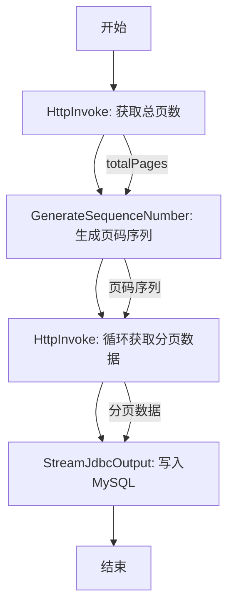

# 基于DataY通过HTTP接口获取分页数据，并自动循环调用所有分页数据写入MySQL数据库

## 1. DataY 项目介绍

DataY = DataX + NIFI ,是一个轻量、可嵌入、可扩展、高性能、流批一体的数据集成工具，支持通过JSON配置文件的方式定义任务，并执行数据集成任务。内置DuckDB引擎和组件，复用DuckDB强大的数据处理能力和性能。

### 核心特性
- **简单易用**: 通过JSON配置文件定义数据集成任务，无需复杂编码
- **可嵌入**: 可作为库嵌入到其他应用中，提供灵活的数据处理能力
- **可扩展**: 支持组件扩展，满足多样化需求
- **高性能**: 内置DuckDB引擎，支持SQL进行高效数据处理
- **流批一体**: 支持流处理和批处理任务，可根据场景选择合适的处理模式
- **任务编排**: 支持复杂的数据处理流程编排

## 2. 同步场景说明

### 2.1 场景描述
本案例演示如何通过HTTP接口获取分页数据，并自动循环调用所有分页数据，最终将数据写入MySQL数据库。

**业务场景：**
- 从第三方API获取分页的业务数据
- 自动识别总页数并循环获取所有数据
- 将获取的数据写入目标MySQL数据库

### 2.2 同步流程图



**流程说明：**
1. **获取总页数**：调用HTTP接口获取数据总页数
2. **生成页码序列**：根据总页数生成从1到总页数的序列
3. **循环获取数据**：对每个页码调用分页接口获取数据
4. **数据写入**：将获取的数据写入MySQL目标表

## 3. 同步任务操作步骤

### 3.1 环境准备

**系统要求：**
- Java 17+ 运行环境
- 目标数据库连接信息
- 源http接口信息

### 3.2 构建Jar包

**通过Maven构建获取DataY运行包：**
```bash
# 进入项目根目录
cd datay

# 构建项目（跳过测试以加快构建速度）
mvn clean package -DskipTests

# 构建完成后，JAR包位于target目录
ls target/datay-*-jar-with-dependencies.jar
```

### 3.3 任务配置

创建任务配置文件 `http_pagination_sync.json`：

```json
{
  "units": [
    {
      ".id": "getTotalPages",
      ".name": "HttpInvoke",
      "method": "POST",
      "url": "https://127.0.0.1:8080/apitest",
      "headers": {
        "Content-Type": "application/json"
      },
      "body": "{}",
      "jsonPath": "$.totalPages"
    },
    {
      ".id": "GenerateSequenceNumber",
      ".name": "GenerateSequenceNumber",
      "startValue": "1",
      "countValue": "${FLOW_FILE_DATA}"
    },
    {
      ".id": "getDateByHttp",
      ".name": "HttpInvoke",
      "method": "POST",
      "url": "https://127.0.0.1:8080/apitest?page=${FLOW_FILE_DATA}",
      "headers": {
        "Content-Type": "application/json"
      },
      "body": "{}",
      "jsonPath": "$.data"
    },
    {
      ".id": "StreamJdbcOutput",
      ".name": "StreamJdbcOutput",
      "parallelism": "1",
      "datasource": {
        "url": "jdbc:mysql://127.0.0.1:3306",
        "driver": "com.mysql.jdbc.Driver",
        "username": "root",
        "password": "1234qwer",
        "dbschema": "target"
      },
      "schema": "target",
      "table": "table",
      "model": "overwrite",
      "header_map": [
        {
          "source": "id",
          "target": "id"
        },
        {
          "source": "ccode",
          "target": "cname"
        },
        {
          "source": "ccode",
          "target": "ccode"
        },
        {
          "source": "ccode",
          "target": "ytenant_id"
        },
        {
          "source": "pubts",
          "target": "pubts"
        }
      ]
    }
  ],
  "connections": [
    {
      "sourceId": "getTotalPages",
      "targetId": "GenerateSequenceNumber"
    },
    {
      "sourceId": "GenerateSequenceNumber",
      "targetId": "getDateByHttp"
    },
    {
      "sourceId": "getDateByHttp",
      "targetId": "StreamJdbcOutput"
    }
  ]
}
```

### 3.4 任务执行

**启动数据同步任务：**
```bash
java -jar datay-1.0.3-jar-with-dependencies.jar http_pagination_sync.json
```

## 4. 任务文件配置说明

### 4.1 整体结构

任务配置文件采用JSON格式，包含两个主要部分：
- **units**：定义数据流中的各个组件
- **connections**：定义组件之间的连接关系

### 4.2 组件详细说明

#### 4.2.1 HttpInvoke 组件

HttpInvoke组件用于调用外部HTTP接口并获取数据。

**参数说明：**

| 参数名 | 类型 | 必填 | 描述 | 示例值 |
|--------|------|------|------|--------|
| `.id` | String | ✅ | 组件唯一标识 | "getTotalPages" |
| `.name` | String | ✅ | 组件名称 | "HttpInvoke" |
| `method` | String | ✅ | HTTP请求方法 | "POST" |
| `url` | String | ✅ | 请求URL地址 | "https://api.example.com/data" |
| `headers` | Object | ✅ | 请求头配置 | `{"Content-Type": "application/json"}` |
| `body` | String | ✅ | 请求体内容 | "{}" |
| `jsonPath` | String | ✅ | JSON路径提取 | "$.totalPages" |

**功能特性：**
- 支持GET/POST/PUT/DELETE等HTTP方法
- 支持请求头和请求体配置
- 支持JSON路径提取，可从响应中提取特定字段
- 支持动态参数替换（使用`${FLOW_FILE_DATA}`时，会从上游组件传递下来的FlowFile中获取数据并替换）

#### 4.2.2 GenerateSequenceNumber 组件

GenerateSequenceNumber组件用于生成数字序列。

**参数说明：**

| 参数名 | 类型 | 必填 | 描述 | 示例值 |
|--------|------|------|------|--------|
| `.id` | String | ✅ | 组件唯一标识 | "GenerateSequenceNumber" |
| `.name` | String | ✅ | 组件名称 | "GenerateSequenceNumber" |
| `startValue` | String | ✅ | 序列起始值 | "1" |
| `countValue` | String | ✅ | 序列数量 | "${FLOW_FILE_DATA}" |

**功能特性：**
- 生成从起始值开始的数字序列
- 支持从上游组件动态获取序列数量
- 每个序列值生成一个独立的FlowFile

#### 4.2.3 StreamJdbcOutput 组件

StreamJdbcOutput组件用于将数据写入关系型数据库。

**参数说明：**

| 参数名 | 类型 | 必填 | 描述 | 示例值 |
|--------|------|------|------|--------|
| `.id` | String | ✅ | 组件唯一标识 | "StreamJdbcOutput" |
| `.name` | String | ✅ | 组件名称 | "StreamJdbcOutput" |
| `parallelism` | String | ✅ | 并行度 | "1" |
| `datasource.url` | String | ✅ | 数据库连接URL | "jdbc:mysql://127.0.0.1:3306" |
| `datasource.driver` | String | ✅ | JDBC驱动类 | "com.mysql.jdbc.Driver" |
| `datasource.username` | String | ✅ | 数据库用户名 | "root" |
| `datasource.password` | String | ✅ | 数据库密码 | "1234qwer" |
| `datasource.dbschema` | String | ✅ | 数据库模式 | "target" |
| `schema` | String | ✅ | 目标表schema | "target" |
| `table` | String | ✅ | 目标表名 | "t_business_info" |
| `model` | String | ✅ | 写入模式 | "overwrite" |
| `header_map` | Array | ✅ | 字段映射 | 见示例 |

**写入模式说明：**
- **append**：追加模式，在现有数据基础上增加新数据
- **update**：更新模式，根据主键更新记录
- **replace**：替换模式，替换现有记录
- **overwrite**：覆盖模式，先清空表再插入数据
- **auto**：自动模式，根据事件类型选择操作

### 4.3 连接关系说明

**connections配置：**
```json
{
  "sourceId": "getTotalPages",
  "targetId": "GenerateSequenceNumber"
}
```

**连接关系：**
1. `getTotalPages` → `GenerateSequenceNumber`：传递总页数
2. `GenerateSequenceNumber` → `getDateByHttp`：传递页码序列
3. `getDateByHttp` → `StreamJdbcOutput`：传递分页数据

## 5. 组件参数详细说明

### 5.1 HttpInvoke 组件详细参数

**url 参数：**
- 作用：指定HTTP请求的目标URL
- 格式：完整的HTTP/HTTPS URL
- 支持动态参数：`${FLOW_FILE_DATA}` 表示上游组件传递的数据
- 示例：`"https://api.example.com/data?page=${FLOW_FILE_DATA}"`

**headers 参数：**
- 作用：配置HTTP请求头
- 格式：JSON对象，键值对形式
- 常用头信息：
  - `Content-Type`：请求体类型（application/json等）
  - `Authorization`：认证信息
  - `User-Agent`：客户端标识

**jsonPath 参数：**
- 作用：从JSON响应中提取特定字段
- 语法：JSONPath表达式
- 常用表达式：
  - `$.totalPages`：提取根节点的totalPages字段
  - `$.data`：提取根节点的data字段

### 5.2 GenerateSequenceNumber 组件详细参数

**startValue 参数：**
- 作用：指定序列的起始值
- 类型：字符串（支持数字转换）
- 默认值："1"
- 示例：`"0"` 表示从0开始生成序列

**countValue 参数：**
- 作用：指定序列的数量
- 支持动态值：`${FLOW_FILE_DATA}` 表示使用上游组件传递的值
- 示例：如果上游传递值为"10"，则生成1-10的序列

### 5.3 StreamJdbcOutput 组件详细参数

**datasource 配置：**
- **url**：数据库连接字符串
  - MySQL格式：`jdbc:mysql://host:port/database`
- **driver**：JDBC驱动类名
  - MySQL：`com.mysql.jdbc.Driver` 或 `com.mysql.cj.jdbc.Driver`
- **username/password**：数据库认证信息

**header_map 配置：**
- 作用：定义源字段到目标字段的映射关系
- 格式：数组对象，每个对象包含source和target字段
- 映射规则：
  - 支持一对一字段映射
  - 支持字段重命名

---

*本文档基于DataY v1.0.3版本编写，适用于通过HTTP接口获取分页数据，并自动循环调用所有分页数据，最终将数据写入MySQL数据库*
