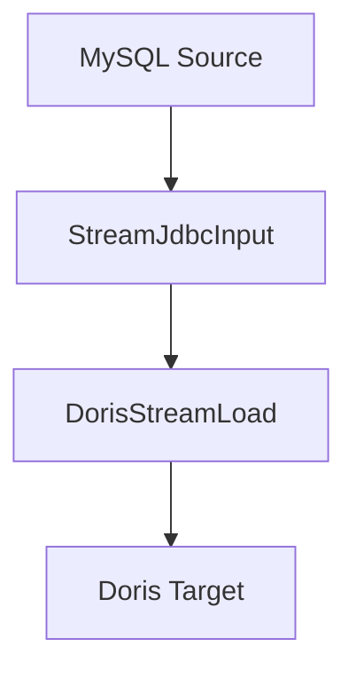

# MySQL同步到Doris场景案例文档

## 1. DataY 介绍

DataY 是一个轻量、可嵌入、可扩展、高性能、流批一体的数据集成工具，支持通过JSON配置文件的方式定义任务，并执行数据集成任务。内置DuckDB引擎和组件，复用DuckDB强大的数据处理能力和性能。

### 核心特性
- **简单易用**: 通过JSON配置文件定义数据集成任务，无需复杂编码
- **可嵌入**: 可作为库嵌入到其他应用中，提供灵活的数据处理能力
- **可扩展**: 支持组件扩展，满足多样化需求
- **高性能**: 内置DuckDB引擎，支持SQL进行高效数据处理
- **流批一体**: 支持流处理和批处理任务，可根据场景选择合适的处理模式
- **任务编排**: 支持复杂的数据处理流程编排

## 2. 同步场景说明

### 场景描述
本案例演示如何使用DataY实现从MySQL数据库的`source`模式下的`common_data_types`表同步到Doris数据库的`test_doris`模式下的同名表。

### 同步流程图



**流程说明:**
1. **数据源**: MySQL数据库的`source.common_data_types`表
2. **输入组件**: StreamJdbcInput - 流式读取MySQL数据
3. **输出组件**: DorisStreamLoad - 使用Doris Stream Load协议流式写入到Doris表
4. **同步模式**: 全量覆盖模式(overwrite)

## 3. 同步任务操作步骤

### 3.1 环境准备

#### 数据库准备
源数据库创建相应的表结构：
```sql
-- 源数据库 (source模式)
CREATE DATABASE IF NOT EXISTS source;
USE source;

CREATE TABLE common_data_types (
    id INT PRIMARY KEY AUTO_INCREMENT,
    name VARCHAR(100),
    description TEXT,
    created_time DATETIME DEFAULT CURRENT_TIMESTAMP
);
```

目标Doris数据库创建相应的表结构：
```sql
-- 目标Doris数据库 (test_doris模式)
CREATE DATABASE IF NOT EXISTS test_doris;
USE test_doris;

CREATE TABLE common_data_types (
    id INT,
    name VARCHAR(100),
    description TEXT,
    created_time DATETIME
) ENGINE=OLAP
DUPLICATE KEY(id)
DISTRIBUTED BY HASH(id) BUCKETS 10
PROPERTIES (
    "replication_num" = "3"
);
```

### 3.2 构建JAR包

**通过Maven构建获取DataY运行包：**
```bash
# 进入项目根目录
cd datay

# 构建项目（跳过测试以加快构建速度）
mvn clean package -DskipTests

# 构建完成后，JAR包位于target目录
ls target/datay-*-jar-with-dependencies.jar
```

### 3.3 任务配置文件

创建任务配置文件 `mysql_to_doris_sync_task.json`：

```json
{
  "units": [
    {
      ".id": "aaaa",
      ".name": "StreamJdbcInput",
      "datasource": {
        "url": "jdbc:mysql://127.0.0.1:3306",
        "driver": "com.mysql.cj.jdbc.Driver",
        "username": "root",
        "password": "password",
        "dbschema": "source"
      },
      "schema": "source",
      "table": "common_data_types"
    },
    {
      ".id": "bbbb",
      ".name": "DorisStreamLoad",
      "datasource": {
        "url": "jdbc:mysql://172.20.49.61:19030",
        "type": "Doris",
        "driver": "com.mysql.cj.jdbc.Driver",
        "username": "root",
        "password": "datafusion@123",
        "dbschema": "test_doris",
        "extraParams": {
          "fe_endpoint": "http://172.20.49.61:18030"
        }
      },
      "schema": "test_doris",
      "table": "",
      "columnsMap": "",
      "model": "overwrite"
    }
  ],
  "connections": [
    {
      "sourceId": "aaaa",
      "targetId": "bbbb"
    }
  ]
}
```

### 3.4 执行同步任务

```bash
# 执行同步任务
java -jar datay-1.0.1-jar-with-dependencies.jar mysql_to_doris_sync_task.json
```

## 4. 任务文件配置说明

### 4.1 整体结构
任务配置文件采用JSON格式，包含以下主要部分：
- `units`: 任务执行单元数组
- `connections`: 单元之间的连接关系

### 4.2 配置参数详解

#### units 数组
包含所有数据处理单元，每个单元代表一个数据处理步骤。

#### connections 数组
定义单元之间的数据流向关系。

## 5. 组件描述与参数说明

### 5.1 StreamJdbcInput 组件

#### 组件描述
流式JDBC输入组件，用于从关系型数据库（如MySQL）中流式读取数据。支持并行读取和条件过滤。

#### 参数说明

| 参数名 | 类型 | 必填 | 默认值 | 描述 |
|--------|------|------|--------|------|
| `.id` | String | 是 | - | 组件唯一标识符 |
| `.name` | String | 是 | - | 组件名称，固定为"StreamJdbcInput" |
| `datasource.url` | String | 是 | - | 数据库连接URL |
| `datasource.driver` | String | 是 | - | JDBC驱动类名 |
| `datasource.username` | String | 是 | - | 数据库用户名 |
| `datasource.password` | String | 是 | - | 数据库密码 |
| `datasource.dbschema` | String | 是 | - | 数据库模式名 |
| `schema` | String | 是 | - | 数据库模式名（与datasource.dbschema一致） |
| `table` | String | 是 | - | 要读取的表名 |

#### 示例配置
```json
{
  ".id": "aaaa",
  ".name": "StreamJdbcInput",
  "datasource": {
    "url": "jdbc:mysql://127.0.0.1:3306",
    "driver": "com.mysql.cj.jdbc.Driver",
    "username": "root",
    "password": "password",
    "dbschema": "source"
  },
  "schema": "source",
  "table": "common_data_types"
}
```

### 5.2 DorisStreamLoad 组件

#### 组件描述
Doris流式加载组件，使用Doris的Stream Load协议将数据流式写入到Doris数据库中。支持自动创建表、数据转换和批量加载。

#### 参数说明

| 参数名 | 类型 | 必填 | 默认值 | 描述 |
|--------|------|------|--------|------|
| `.id` | String | 是 | - | 组件唯一标识符 |
| `.name` | String | 是 | - | 组件名称，固定为"DorisStreamLoad" |
| `datasource.url` | String | 是 | - | Doris FE的JDBC连接URL |
| `datasource.type` | String | 是 | - | 数据库类型，固定为"Doris" |
| `datasource.driver` | String | 是 | - | JDBC驱动类名 |
| `datasource.username` | String | 是 | - | Doris数据库用户名 |
| `datasource.password` | String | 是 | - | Doris数据库密码 |
| `datasource.dbschema` | String | 是 | - | Doris数据库模式名 |
| `datasource.extraParams.fe_endpoint` | String | 是 | - | Doris FE的HTTP端点，用于Stream Load |
| `schema` | String | 是 | - | 目标数据库模式名 |
| `table` | String | 否 | - | 目标表名，为空时从源表继承 |
| `columnsMap` | String | 否 | - | 列映射关系，为空时使用自动映射 |
| `model` | String | 是 | - | 写入模式：overwrite(覆盖)/append(追加) |
| `maxRows` | Integer | 否 | 20000 | 每次Stream Load的最大行数 |

#### 写入模式说明
- **overwrite**: 先清空目标表，再插入数据（全量同步）
- **insert**: 在目标表现有数据基础上追加数据（增量同步）
- **auto**: 根据flowfile中的事件类型自动选择写入模式

##### 自动模式说明
当`model`设置为"auto"时，组件会根据CDC事件类型自动选择写入策略：
- **INSERT事件**: 执行INSERT语句
- **UPDATE事件**: 执行UPDATE语句（基于主键）
- **DELETE事件**: 执行DELETE语句（基于主键）
- **DDL事件**: 自动执行DDL语句

#### 示例配置
```json
{
  ".id": "bbbb",
  ".name": "DorisStreamLoad",
  "datasource": {
    "url": "jdbc:mysql://172.20.49.61:19030",
    "type": "Doris",
    "driver": "com.mysql.cj.jdbc.Driver",
    "username": "root",
    "password": "datafusion@123",
    "dbschema": "test_doris",
    "extraParams": {
      "fe_endpoint": "http://172.20.49.61:18030"
    }
  },
  "schema": "test_doris",
  "table": "",
  "columnsMap": "",
  "model": "overwrite"
}
```

### 5.3 Connections 配置

#### 配置说明
定义数据流在各个组件之间的流向关系。

| 参数名 | 类型 | 必填 | 描述 |
|--------|------|------|------|
| `sourceId` | String | 是 | 源组件的ID |
| `targetId` | String | 是 | 目标组件的ID |

#### 示例配置
```json
{
  "sourceId": "aaaa",
  "targetId": "bbbb"
}
```

## 6. 常见问题与解决方案

### 6.1 Doris连接问题
**问题**: Doris数据库连接失败
**解决方案**:
- 检查Doris FE服务是否正常启动
- 验证连接URL、用户名、密码是否正确
- 确认网络连通性，特别是FE HTTP端口(18030)和MySQL端口(19030)

### 6.2 Stream Load失败问题
**问题**: Stream Load操作失败
**解决方案**:
- 检查Doris FE的HTTP端点配置是否正确
- 确认Doris BE服务状态正常
- 查看Doris FE日志获取详细错误信息

### 6.3 数据类型映射问题
**问题**: 数据类型转换失败
**解决方案**:
- 检查源表和目标表的字段类型是否兼容
- 使用`columnsMap`参数手动指定字段映射关系
- 确认Doris支持的数据类型范围

### 6.4 权限问题
**问题**: 数据库操作权限不足
**解决方案**:
- 确保MySQL用户具有源表的读取权限
- 确保Doris用户具有目标表的写入权限
- 检查Doris用户的Stream Load权限设置

## 7. 扩展应用场景

### 7.1 增量同步
通过添加增量字段配置，实现增量数据同步：
```text
"incrColumn": "update_time"
```

### 7.2 多表同步
支持同时同步多个表：
```text
"table": "table1,table2,table3"
```

### 7.3 条件过滤
通过WHERE条件实现数据过滤：
```text
"where": "status = 'ACTIVE' AND create_time > '2024-01-01'"
```

### 7.4 字段映射
通过columnsMap实现字段映射：
```text
"columnsMap": "id=user_id,name=user_name,description=user_desc"
```

## 8. 总结

本案例详细介绍了使用DataY实现MySQL到Doris数据同步的完整流程。通过简单的JSON配置，即可实现高效、稳定的数据同步任务。DataY的流式处理能力和Doris Stream Load协议的结合，使其成为大数据场景下数据同步的理想选择。

**核心优势**:
- 配置简单，学习成本低
- 性能优异，支持Doris Stream Load协议
- 支持自动表创建和数据类型转换
- 部署灵活，可独立运行或嵌入应用

通过本案例的学习，您可以快速掌握DataY与Doris集成的使用方法，并根据实际需求进行定制化配置，满足大数据场景下的数据同步需求。
