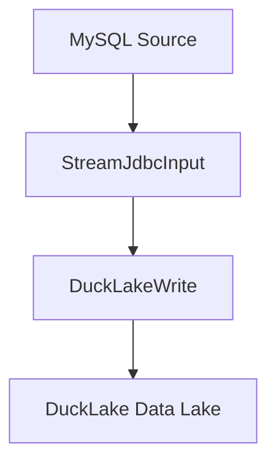

# MySQL同步到DuckLake场景案例文档

## 1. DataY 介绍

DataY 是一个轻量、可嵌入、可扩展、高性能、流批一体的数据集成工具，支持通过JSON配置文件的方式定义任务，并执行数据集成任务。内置DuckDB引擎和组件，复用DuckDB强大的数据处理能力和性能。

### 核心特性
- **简单易用**: 通过JSON配置文件定义数据集成任务，无需复杂编码
- **可嵌入**: 可作为库嵌入到其他应用中，提供灵活的数据处理能力
- **可扩展**: 支持组件扩展，满足多样化需求
- **高性能**: 内置DuckDB引擎，支持SQL进行高效数据处理
- **流批一体**: 支持流处理和批处理任务，可根据场景选择合适的处理模式
- **任务编排**: 支持复杂的数据处理流程编排

## 2. 同步场景说明

### 场景描述
本案例演示如何使用DataY实现从MySQL数据库的`source`模式下的`common_data_types`和`common_data_types_copy1`表同步到DuckLake数据湖中。DuckLake是一个基于DuckDB的云原生数据湖解决方案，支持S3对象存储作为数据存储后端。

### 同步流程图



**流程说明:**
1. **数据源**: MySQL数据库的`source.common_data_types`和`source.common_data_types_copy1`表
2. **输入组件**: StreamJdbcInput - 流式读取MySQL数据
3. **输出组件**: DuckLakeWrite - 将数据写入DuckLake数据湖
4. **存储后端**: S3对象存储作为数据持久化层
5. **元数据存储**: PostgreSQL数据库存储表结构元数据
6. **同步模式**: 全量覆盖模式(overwrite)

## 3. 同步任务操作步骤

### 3.1 环境准备

#### 数据库准备
源数据库创建相应的表结构：
```sql
-- 源MySQL数据库 (source模式)
CREATE DATABASE IF NOT EXISTS source;
USE source;

-- 创建common_data_types表
CREATE TABLE common_data_types (
    id INT PRIMARY KEY AUTO_INCREMENT,
    name VARCHAR(100),
    description TEXT,
    created_time DATETIME DEFAULT CURRENT_TIMESTAMP
);

-- 创建common_data_types_copy1表
CREATE TABLE common_data_types_copy1 (
    id INT PRIMARY KEY AUTO_INCREMENT,
    name VARCHAR(100),
    description TEXT,
    created_time DATETIME DEFAULT CURRENT_TIMESTAMP
);
```

#### DuckLake环境准备
确保以下服务正常运行：
- **MinIO/S3**: 对象存储服务，端口9000
- **PostgreSQL**: 元数据存储服务，端口5432
- **DuckLake**: 数据湖服务正常运行

### 3.2 构建JAR包

**通过Maven构建获取DataY运行包：**
```bash
# 克隆项目
git clone https://cnb.cool/yuyuejia/datay.git

# 进入项目根目录
cd datay

# 构建项目（跳过测试以加快构建速度）
mvn clean package -DskipTests

# 构建完成后，JAR包位于target目录
ls target/datay-*-jar-with-dependencies.jar
```

### 3.3 任务配置文件

创建任务配置文件 `mysql_to_ducklake_sync_task.json`：

```json
{
  "units": [
    {
      ".id": "c125de36",
      ".name": "StreamJdbcInput",
      "datasource": {
        "url": "jdbc:mysql://127.0.0.1:3306",
        "driver": "com.mysql.jdbc.Driver",
        "username": "root",
        "password": "password",
        "dbschema": "source"
      },
      "table": "common_data_types,common_data_types_copy1",
      "incrColumn": "",
      "where": ""
    },
    {
      ".id": "a949c10a",
      ".name": "DuckLakeWrite",
      "datasource": {
        "url": "ducklake:metadata.ducklake",
        "driver": "com.duckdb.jdbc.Driver",
        "dbschema": "main",
        "extraParams": {
          "warehouse": "metadata",
          "s3.key_id": "IS45iEIUl0DolyJLD8ap",
          "s3.secret": "roEGUK18Bd0qPkOU4ZBMCspB6PtJvwkHRCU11d5z",
          "s3.endpoint": "127.0.0.1:9000",
          "s3.url_style": "path",
          "s3.use_ssl": "false",
          "s3.data_path": "s3://test/test",
          "meta.url": "jdbc:postgresql://127.0.0.1:5432/ducklake_catalog",
          "meta.driver": "org.postgresql.Driver",
          "meta.username": "root",
          "meta.password": "1234qwer"
        }
      },
      "schema": "main",
      "table": "",
      "model": "overwrite"
    }
  ],
  "connections": [
    {
      "sourceId": "c125de36",
      "targetId": "a949c10a"
    }
  ]
}
```

### 3.4 执行同步任务

```bash
# 执行同步任务
java -jar datay-1.0.1-jar-with-dependencies.jar mysql_to_ducklake_sync_task.json
```

## 4. 任务文件配置说明

### 4.1 整体结构
任务配置文件采用JSON格式，包含以下主要部分：
- `units`: 任务执行单元数组
- `connections`: 单元之间的连接关系

### 4.2 配置参数详解

#### units 数组
包含所有数据处理单元，每个单元代表一个数据处理步骤。

#### connections 数组
定义单元之间的数据流向关系。

## 5. 组件描述与参数说明

### 5.1 StreamJdbcInput 组件

#### 组件描述
流式JDBC输入组件，用于从关系型数据库（如MySQL）中流式读取数据。支持多表同步、增量同步和条件过滤。

#### 参数说明

| 参数名 | 类型 | 必填 | 默认值 | 描述 |
|--------|------|------|--------|------|
| `.id` | String | 是 | - | 组件唯一标识符 |
| `.name` | String | 是 | - | 组件名称，固定为"StreamJdbcInput" |
| `datasource.url` | String | 是 | - | MySQL数据库连接URL |
| `datasource.driver` | String | 是 | - | JDBC驱动类名 |
| `datasource.username` | String | 是 | - | 数据库用户名 |
| `datasource.password` | String | 是 | - | 数据库密码 |
| `datasource.dbschema` | String | 是 | - | 数据库模式名 |
| `table` | String | 是 | - | 要同步的表名，支持多表（逗号分隔） |
| `maxRowsPerPartition` | String | 否 | "10000" | 每个分区的最大行数 |
| `incrColumn` | String | 否 | - | 增量字段配置 |
| `where` | String | 否 | - | 自定义WHERE条件 |

#### 示例配置
```json
{
  ".id": "c125de36",
  ".name": "StreamJdbcInput",
  "datasource": {
    "url": "jdbc:mysql://127.0.0.1:3306",
    "driver": "com.mysql.jdbc.Driver",
    "username": "root",
    "password": "1234qwer",
    "dbschema": "source"
  },
  "table": "common_data_types,common_data_types_copy1",
  "incrColumn": "",
  "where": ""
}
```

### 5.2 DuckLakeWrite 组件

#### 组件描述
DuckLake数据写入组件，用于将数据写入DuckLake数据湖。支持自动表创建、多种写入模式和S3对象存储集成。

#### 参数说明

| 参数名 | 类型 | 必填 | 默认值 | 描述 |
|--------|------|------|--------|------|
| `.id` | String | 是 | - | 组件唯一标识符 |
| `.name` | String | 是 | - | 组件名称，固定为"DuckLakeWrite" |
| `datasource.url` | String | 是 | - | DuckLake连接URL |
| `datasource.driver` | String | 是 | - | DuckDB JDBC驱动类名 |
| `datasource.dbschema` | String | 是 | - | 目标数据库模式名 |
| `datasource.extraParams` | Object | 是 | - | DuckLake扩展参数配置 |
| `schema` | String | 否 | - | 目标模式名 |
| `table` | String | 否 | - | 目标表名 |
| `model` | String | 否 | "INSERT" | 写入模式：insert, append, overwrite, delete |

#### DuckLake扩展参数说明

| 参数名 | 类型 | 必填 | 描述 |
|--------|------|------|------|
| `warehouse` | String | 是 | 数据仓库名称 |
| `s3.key_id` | String | 是 | S3访问密钥ID |
| `s3.secret` | String | 是 | S3访问密钥 |
| `s3.endpoint` | String | 是 | S3服务端点 |
| `s3.url_style` | String | 是 | S3 URL风格（path/virtual） |
| `s3.use_ssl` | String | 是 | 是否使用SSL连接 |
| `s3.data_path` | String | 是 | S3数据存储路径 |
| `meta.url` | String | 是 | 元数据存储PostgreSQL连接URL |
| `meta.driver` | String | 是 | PostgreSQL驱动类名 |
| `meta.username` | String | 是 | 元数据存储用户名 |
| `meta.password` | String | 是 | 元数据存储密码 |

#### 示例配置
```json
{
  ".id": "a949c10a",
  ".name": "DuckLakeWrite",
  "datasource": {
    "url": "ducklake:metadata.ducklake",
    "driver": "com.duckdb.jdbc.Driver",
    "dbschema": "main",
    "extraParams": {
      "warehouse": "metadata",
      "s3.key_id": "IS45iEIUl0DolyJLD8ap",
      "s3.secret": "roEGUK18Bd0qPkOU4ZBMCspB6PtJvwkHRCU11d5z",
      "s3.endpoint": "127.0.0.1:9000",
      "s3.url_style": "path",
      "s3.use_ssl": "false",
      "s3.data_path": "s3://test/test",
      "meta.url": "jdbc:postgresql://127.0.0.1:5432/ducklake_catalog",
      "meta.driver": "org.postgresql.Driver",
      "meta.username": "root",
      "meta.password": "1234qwer"
    }
  },
  "schema": "main",
  "table": "",
  "model": "overwrite"
}
```

## 6. 技术实现细节

### 6.1 StreamJdbcInput技术特点
- **多表同步**: 支持同时同步多个数据库表
- **流式读取**: 使用数据库游标避免内存溢出
- **批量处理**: 每10,000条记录批量发送到下游
- **增量同步**: 支持基于增量字段的增量数据同步

### 6.2 DuckLakeWrite技术特点
- **自动表管理**: 支持自动创建目标表结构
- **S3集成**: 支持S3对象存储作为数据持久化层
- **高性能写入**: 使用多值INSERT语句提高写入性能

### 6.3 数据流处理流程
1. **数据读取**: StreamJdbcInput从MySQL读取数据
2. **数据转换**: 自动进行数据类型映射和转换
3. **表结构同步**: DuckLakeWrite自动创建目标表结构
4. **数据写入**: 使用Stream Load协议写入DuckLake
5. **状态管理**: 自动管理同步状态和错误处理

---

通过本案例的学习，您可以快速掌握DataY与DuckLake集成的使用方法，并根据实际需求进行定制化配置，满足大数据场景下的数据同步需求。
