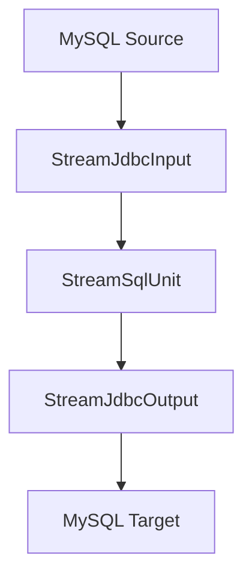

# StreamSqlUnit数据处理案例文档

## 1. DataY 介绍

DataY 是一个轻量、可嵌入、可扩展、高性能、流批一体的数据集成工具，支持通过JSON配置文件的方式定义任务，并执行数据集成任务。内置DuckDB引擎和组件，复用DuckDB强大的数据处理能力和性能。

### 核心特性
- **简单易用**: 通过JSON配置文件定义数据集成任务，无需复杂编码
- **可嵌入**: 可作为库嵌入到其他应用中，提供灵活的数据处理能力
- **可扩展**: 支持组件扩展，满足多样化需求
- **高性能**: 内置DuckDB引擎，支持SQL进行高效数据处理
- **流批一体**: 支持流处理和批处理任务，可根据场景选择合适的处理模式
- **任务编排**: 支持复杂的数据处理流程编排

## 2. 数据处理场景说明

### 场景描述
本案例演示如何使用DataY实现从MySQL源数据库读取原始数据，通过StreamSqlUnit组件进行数据清洗和转换，最后写入到目标MySQL数据库的完整数据处理流程。

### 数据处理流程图



**流程说明:**
1. **数据源**: MySQL数据库的`source_db.raw_data`表
2. **输入组件**: StreamJdbcInput - 流式读取MySQL原始数据
3. **处理组件**: StreamSqlUnit - 使用DuckDB SQL进行数据清洗和转换
4. **输出组件**: StreamJdbcOutput - 流式写入到目标MySQL表
5. **同步模式**: 追加模式(append)

## 3. 数据处理任务操作步骤

### 3.1 环境准备

#### 数据库准备
源数据库和目标数据库创建相应的表结构：

```sql
-- 源数据库表结构
CREATE DATABASE IF NOT EXISTS source_db;
USE source_db;

CREATE TABLE raw_data (
    id INT PRIMARY KEY AUTO_INCREMENT,
    name VARCHAR(100),
    email VARCHAR(100),
    age VARCHAR(10),
    created_time DATETIME DEFAULT CURRENT_TIMESTAMP
);

-- 目标数据库表结构
CREATE DATABASE IF NOT EXISTS target_db;
USE target_db;

CREATE TABLE clean_data (
    id INT PRIMARY KEY,
    clean_name VARCHAR(100),
    email VARCHAR(100),
    age_int INT,
    processed_time DATETIME DEFAULT CURRENT_TIMESTAMP
);
```

### 3.2 构建JAR包

**通过Maven构建获取DataY运行包：**
```bash
# 进入项目根目录
cd datay

# 构建项目（跳过测试以加快构建速度）
mvn clean package -DskipTests

# 构建完成后，JAR包位于target目录
ls target/datay-*-jar-with-dependencies.jar
```

### 3.3 任务配置文件

创建任务配置文件 `data_processing_task.json`：

```json
{
  "units": [
    {
      ".id": "jdbc_input",
      ".name": "StreamJdbcInput",
      "datasource": {
        "url": "jdbc:mysql://localhost:3306/source_db",
        "driver": "com.mysql.cj.jdbc.Driver",
        "username": "user",
        "password": "password",
        "dbschema": "source_db"
      },
      "table": "raw_data"
    },
    {
      ".id": "data_cleaner",
      ".name": "StreamSqlUnit",
      "sql": "SELECT id, TRIM(name) as clean_name, COALESCE(email, 'unknown') as email, CAST(age AS INTEGER) as age_int FROM input_table WHERE age IS NOT NULL AND age != ''"
    },
    {
      ".id": "mysql_output",
      ".name": "StreamJdbcOutput",
      "datasource": {
        "url": "jdbc:mysql://localhost:3306/target_db",
        "driver": "com.mysql.cj.jdbc.Driver",
        "username": "user",
        "password": "password",
        "dbschema": "target_db"
      },
      "table": "clean_data",
      "model": "append"
    }
  ],
  "connections": [
    {
      "sourceId": "jdbc_input",
      "targetId": "data_cleaner"
    },
    {
      "sourceId": "data_cleaner",
      "targetId": "mysql_output"
    }
  ]
}
```

### 3.4 执行数据处理任务

```bash
# 执行数据处理任务
java -jar datay-1.0.1-jar-with-dependencies.jar data_processing_task.json
```

## 4. 任务文件配置说明

### 4.1 整体结构
任务配置文件采用JSON格式，包含以下主要部分：
- `units`: 任务执行单元数组
- `connections`: 单元之间的连接关系

### 4.2 配置参数详解

#### units 数组
包含所有数据处理单元，每个单元代表一个数据处理步骤。

#### connections 数组
定义单元之间的数据流向关系。

## 5. 组件描述与参数说明

### 5.1 StreamJdbcInput 组件

#### 组件描述
流式JDBC输入组件，用于从关系型数据库（如MySQL）中流式读取数据。支持并行读取和条件过滤。

#### 参数说明

| 参数名 | 类型 | 必填 | 默认值 | 描述 |
|--------|------|------|--------|------|
| `.id` | String | 是 | - | 组件唯一标识符 |
| `.name` | String | 是 | - | 组件名称，固定为"StreamJdbcInput" |
| `datasource.url` | String | 是 | - | 数据库连接URL |
| `datasource.driver` | String | 是 | - | JDBC驱动类名 |
| `datasource.username` | String | 是 | - | 数据库用户名 |
| `datasource.password` | String | 是 | - | 数据库密码 |
| `datasource.dbschema` | String | 是 | - | 数据库模式名 |
| `table` | String | 是 | - | 要读取的表名，多个表用逗号分隔 |
| `where` | String | 否 | "" | WHERE条件，用于数据过滤 |

#### 示例配置
```json
{
  ".id": "jdbc_input",
  ".name": "StreamJdbcInput",
  "datasource": {
    "url": "jdbc:mysql://localhost:3306/source_db",
    "driver": "com.mysql.cj.jdbc.Driver",
    "username": "user",
    "password": "password",
    "dbschema": "source_db"
  },
  "table": "raw_data"
}
```

### 5.2 StreamSqlUnit 组件

#### 组件描述
StreamSqlUnit 是一个流式SQL处理组件，用于在数据流管道中执行DuckDB SQL语句对数据进行转换和处理。该组件接收上游数据，将其写入DuckDB临时表，然后执行配置的SQL语句对数据进行转换和处理，最后将处理结果传递给下游组件。

#### 核心功能特性
- **SQL数据处理**: 支持在数据流中执行任意SQL查询和转换操作
- **DuckDB集成**: 内置DuckDB引擎，提供高性能的SQL处理能力
- **流式处理**: 支持流式数据转换，适合实时数据处理场景
- **自动临时表管理**: 自动创建和管理DuckDB临时表
- **元数据保留**: 保留上游的事件类型和表元数据信息

#### 参数说明

| 参数名 | 类型 | 必填 | 默认值 | 描述 |
|--------|------|------|--------|------|
| `.id` | String | 是 | - | 组件唯一标识符 |
| `.name` | String | 是 | - | 组件名称，固定为"StreamSqlUnit" |
| `sql` | String | 是 | - | 要执行的SQL查询语句 |

#### 数据处理流程
1. **数据接收阶段**: 接收上游组件传递的数据
2. **临时表管理阶段**: 自动创建DuckDB临时表并写入数据
3. **SQL执行阶段**: 执行配置的SQL查询语句
4. **结果输出阶段**: 将处理结果传递给下游组件

#### 示例配置
```json
{
  ".id": "data_cleaner",
  ".name": "StreamSqlUnit",
  "sql": "SELECT id, TRIM(name) as clean_name, COALESCE(email, 'unknown') as email, CAST(age AS INTEGER) as age_int FROM input_table WHERE age IS NOT NULL AND age != ''"
}
```

#### SQL处理说明
在本案例中，StreamSqlUnit执行的SQL语句实现了以下数据清洗功能：
- **TRIM(name)**: 去除姓名字段的前后空格
- **COALESCE(email, 'unknown')**: 处理空邮箱，将空值替换为'unknown'
- **CAST(age AS INTEGER)**: 将年龄字段转换为整数类型
- **WHERE age IS NOT NULL AND age != ''**: 过滤掉年龄为空或空字符串的记录

### 5.3 StreamJdbcOutput 组件

#### 组件描述
流式JDBC输出组件，用于将数据流式写入到关系型数据库（如MySQL）中。支持多种写入模式和并行写入。

#### 参数说明

| 参数名 | 类型 | 必填 | 默认值 | 描述 |
|--------|------|------|--------|------|
| `.id` | String | 是 | - | 组件唯一标识符 |
| `.name` | String | 是 | - | 组件名称，固定为"StreamJdbcOutput" |
| `datasource.url` | String | 是 | - | 数据库连接URL |
| `datasource.driver` | String | 是 | - | JDBC驱动类名 |
| `datasource.username` | String | 是 | - | 数据库用户名 |
| `datasource.password` | String | 是 | - | 数据库密码 |
| `datasource.dbschema` | String | 是 | - | 数据库模式名 |
| `table` | String | 是 | - | 要写入的目标表名 |
| `model` | String | 否 | "append" | 写入模式：append(追加)、overwrite(覆盖)、update(更新) |

#### 示例配置
```json
{
  ".id": "mysql_output",
  ".name": "StreamJdbcOutput",
  "datasource": {
    "url": "jdbc:mysql://localhost:3306/target_db",
    "driver": "com.mysql.cj.jdbc.Driver",
    "username": "user",
    "password": "password",
    "dbschema": "target_db"
  },
  "table": "clean_data",
  "model": "append"
}
```

## 6. 数据处理效果说明

### 原始数据示例
```sql
-- 源表 raw_data 示例数据
id | name     | email           | age | created_time
1  | " John " | "john@test.com" | "25"| 2024-01-01 10:00:00
2  | "Alice"  | NULL            | "30"| 2024-01-01 10:01:00
3  | "Bob"    | "bob@test.com"  | ""  | 2024-01-01 10:02:00
4  | "Eve"    | "eve@test.com"  | "35"| 2024-01-01 10:03:00
```

### 处理后数据示例
```sql
-- 目标表 clean_data 处理后数据
id | clean_name | email           | age_int | processed_time
1  | "John"     | "john@test.com" | 25      | 2024-01-01 10:00:01
2  | "Alice"    | "unknown"       | 30      | 2024-01-01 10:01:01
4  | "Eve"      | "eve@test.com"  | 35      | 2024-01-01 10:03:01
```

### 数据处理效果
- **数据清洗**: 姓名字段去除前后空格
- **空值处理**: 邮箱空值替换为'unknown'
- **类型转换**: 年龄字段转换为整数类型
- **数据过滤**: 过滤掉年龄为空或空字符串的记录（如ID=3的记录）


通过本案例，您可以了解如何使用DataY的StreamSqlUnit组件构建完整的数据处理管道，实现数据的清洗、转换和迁移功能。
