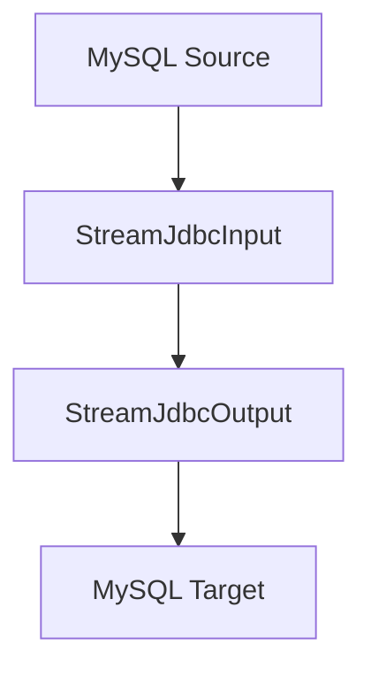

# MySQL同步到MySQL场景案例文档

## 1. DataY 介绍

DataY 是一个轻量、可嵌入、可扩展、高性能、流批一体的数据集成工具，支持通过JSON配置文件的方式定义任务，并执行数据集成任务。内置DuckDB引擎和组件，复用DuckDB强大的数据处理能力和性能。

### 核心特性
- **简单易用**: 通过JSON配置文件定义数据集成任务，无需复杂编码
- **可嵌入**: 可作为库嵌入到其他应用中，提供灵活的数据处理能力
- **可扩展**: 支持组件扩展，满足多样化需求
- **高性能**: 内置DuckDB引擎，支持SQL进行高效数据处理
- **流批一体**: 支持流处理和批处理任务，可根据场景选择合适的处理模式
- **任务编排**: 支持复杂的数据处理流程编排

## 2. 同步场景说明

### 场景描述
本案例演示如何使用DataY实现从MySQL数据库的`source`模式下的`common_data_types`表同步到MySQL数据库的`target`模式下的同名表。

### 同步流程图



**流程说明:**
1. **数据源**: MySQL数据库的`source.common_data_types`表
2. **输入组件**: StreamJdbcInput - 流式读取MySQL数据
3. **输出组件**: StreamJdbcOutput - 流式写入到目标MySQL表
4. **同步模式**: 全量覆盖模式(overwrite)

## 3. 同步任务操作步骤

### 3.1 环境准备

#### 系统要求
- Java 17+
- MySQL 5.7+ 或 MySQL 8.0+

#### 数据库准备
源数据库创建相应的表结构：
```sql
-- 源数据库 (source模式)
CREATE DATABASE IF NOT EXISTS source;
USE source;

CREATE TABLE common_data_types (
    id INT PRIMARY KEY AUTO_INCREMENT,
    name VARCHAR(100),
    description TEXT,
    created_time DATETIME DEFAULT CURRENT_TIMESTAMP
);
```

### 3.2 构建JAR包

**通过Maven构建获取DataY运行包：**
```bash
# 克隆项目
git clone https://cnb.cool/yuyuejia/datay.git

# 进入项目根目录
cd datay

# 构建项目（跳过测试以加快构建速度）
mvn clean package -DskipTests

# 构建完成后，JAR包位于target目录
ls target/datay-*-jar-with-dependencies.jar
```

### 3.3 任务配置文件

创建任务配置文件 `mysql_sync_task.json`：

```json
{
  "units": [
    {
      ".id": "c125de36",
      ".name": "StreamJdbcInput",
      "parallelism": "1",
      "datasource": {
        "url": "jdbc:mysql://127.0.0.1:3306",
        "driver": "com.mysql.jdbc.Driver",
        "username": "root",
        "password": "password",
        "dbschema": "source"
      },
      "table": "common_data_types",
      "where": ""
    },
    {
      ".id": "a949c10a",
      ".name": "StreamJdbcOutput",
      "parallelism": "4",
      "datasource": {
        "url": "jdbc:mysql://127.0.0.1:3306",
        "driver": "com.mysql.jdbc.Driver",
        "username": "root",
        "password": "password",
        "dbschema": "target"
      },
      "table": "common_data_types",
      "model": "overwrite"
    }
  ],
  "connections": [
    {
      "sourceId": "c125de36",
      "targetId": "a949c10a"
    }
  ]
}
```

### 3.4 执行同步任务

```bash
# 执行同步任务
java -jar datay-1.0.1-jar-with-dependencies.jar mysql_sync_task.json
```

## 4. 任务文件配置说明

### 4.1 整体结构
任务配置文件采用JSON格式，包含以下主要部分：
- `units`: 任务执行单元数组
- `connections`: 单元之间的连接关系

### 4.2 配置参数详解

#### units 数组
包含所有数据处理单元，每个单元代表一个数据处理步骤。

#### connections 数组
定义单元之间的数据流向关系。

## 5. 组件描述与参数说明

### 5.1 StreamJdbcInput 组件

#### 组件描述
流式JDBC输入组件，用于从关系型数据库（如MySQL）中流式读取数据。支持并行读取和条件过滤。

#### 参数说明

| 参数名 | 类型 | 必填 | 默认值 | 描述 |
|--------|------|------|--------|------|
| `.id` | String | 是 | - | 组件唯一标识符 |
| `.name` | String | 是 | - | 组件名称，固定为"StreamJdbcInput" |
| `datasource.url` | String | 是 | - | 数据库连接URL |
| `datasource.driver` | String | 是 | - | JDBC驱动类名 |
| `datasource.username` | String | 是 | - | 数据库用户名 |
| `datasource.password` | String | 是 | - | 数据库密码 |
| `datasource.dbschema` | String | 是 | - | 数据库模式名 |
| `table` | String | 是 | - | 要读取的表名，多个表用逗号分隔 |
| `where` | String | 否 | "" | WHERE条件，用于数据过滤 |

#### 示例配置
```json
{
  ".id": "c125de36",
  ".name": "StreamJdbcInput",
  "parallelism": "1",
  "datasource": {
    "url": "jdbc:mysql://127.0.0.1:3306",
    "driver": "com.mysql.jdbc.Driver",
    "username": "root",
    "password": "password",
    "dbschema": "source"
  },
  "table": "common_data_types",
  "where": ""
}
```

### 5.2 StreamJdbcOutput 组件

#### 组件描述
流式JDBC输出组件，用于将数据流式写入到关系型数据库（如MySQL）中。支持多种写入模式和并行写入。

#### 参数说明

| 参数名 | 类型 | 必填 | 默认值 | 描述                                       |
|--------|------|------|--------|------------------------------------------|
| `.id` | String | 是 | - | 组件唯一标识符                                  |
| `.name` | String | 是 | - | 组件名称，固定为"StreamJdbcOutput"               |
| `parallelism` | String | 否 | "1" | 并行度，控制数据写入的并发数                           |
| `datasource.url` | String | 是 | - | 数据库连接URL                                 |
| `datasource.driver` | String | 是 | - | JDBC驱动类名                                 |
| `datasource.username` | String | 是 | - | 数据库用户名                                   |
| `datasource.password` | String | 是 | - | 数据库密码                                    |
| `datasource.dbschema` | String | 是 | - | 数据库模式名                                   |
| `table` | String | 是 | - | 要写入的目标表名                                 |
| `model` | String | 是 | - | 写入模式：overwrite(覆盖)/append(追加)/auto(自动匹配) |

#### 写入模式说明
- **overwrite**: 先清空目标表，再插入数据（全量同步）
- **append**: 在目标表现有数据基础上追加数据（增量同步）

#### 示例配置
```json
{
  ".id": "a949c10a",
  ".name": "StreamJdbcOutput",
  "parallelism": "4",
  "datasource": {
    "url": "jdbc:mysql://127.0.0.1:3306",
    "driver": "com.mysql.jdbc.Driver",
    "username": "root",
    "password": "password",
    "dbschema": "target"
  },
  "table": "common_data_types",
  "model": "overwrite"
}
```

### 5.3 Connections 配置

#### 配置说明
定义数据流在各个组件之间的流向关系。

| 参数名 | 类型 | 必填 | 描述 |
|--------|------|------|------|
| `sourceId` | String | 是 | 源组件的ID |
| `targetId` | String | 是 | 目标组件的ID |

#### 示例配置
```json
{
  "sourceId": "c125de36",
  "targetId": "a949c10a"
}
```

## 6. 常见问题与解决方案

### 6.1 连接失败问题
**问题**: 数据库连接失败
**解决方案**:
- 检查数据库服务是否启动
- 验证连接URL、用户名、密码是否正确
- 确认网络连通性

### 6.2 表不存在问题
**问题**: 源表或目标表不存在
**解决方案**:
- 确认数据库模式名是否正确
- 检查表名拼写是否正确
- 确保表已创建并包含所需字段

### 6.3 权限问题
**问题**: 数据库操作权限不足
**解决方案**:
- 确保数据库用户具有读写权限
- 检查表级别的权限设置

## 7. 扩展应用场景

### 7.1 增量同步
通过添加增量字段配置，实现增量数据同步：
```json
"incrColumn": "update_time"
```

### 7.2 多表同步
支持同时同步多个表：
```json
"table": "table1,table2,table3"
```

### 7.3 条件过滤
通过WHERE条件实现数据过滤：
```json
"where": "status = 'ACTIVE' AND create_time > '2024-01-01'"
```

## 8. 总结

本案例详细介绍了使用DataY实现MySQL到MySQL数据同步的完整流程。通过简单的JSON配置，即可实现高效、稳定的数据同步任务。DataY的流式处理能力和灵活的配置方式，使其成为数据集成场景的理想选择。

**核心优势**:
- 配置简单，学习成本低
- 性能优异，支持流式处理
- 扩展性强，支持多种数据源
- 部署灵活，可独立运行或嵌入应用

通过本案例的学习，您可以快速掌握DataY的基本使用方法，并根据实际需求进行定制化配置。