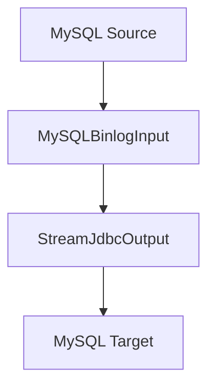

# MySQL CDC实时同步案例文档

## 1. DataY 介绍

DataY = DataX + NIFI , 是一个轻量、可嵌入、可扩展、高性能、流批一体的数据集成工具，支持通过JSON配置文件的方式定义任务，并执行数据集成任务。内置DuckDB引擎和组件，复用DuckDB强大的数据处理能力和性能。

### 核心特性
- **简单易用**: 通过JSON配置文件定义数据集成任务，无需复杂编码
- **可嵌入**: 可作为库嵌入到其他应用中，提供灵活的数据处理能力
- **可扩展**: 支持组件扩展，满足多样化需求
- **高性能**: 内置DuckDB引擎，支持SQL进行高效数据处理
- **流批一体**: 支持流处理和批处理任务，支持CDC实时数据变更捕获
- **任务编排**: 支持复杂的数据处理流程编排

## 2. CDC同步场景说明

### 场景描述
本案例演示如何使用DataY实现MySQL数据库的CDC（Change Data Capture）实时同步，通过MySQLBinlogInput组件实时捕获源数据库的Binlog变更事件，并实时同步到目标MySQL数据库。

### CDC同步流程图



**流程说明:**
1. **数据源**: MySQL数据库的`testfl`模式下的所有表
2. **CDC输入组件**: MySQLBinlogInput - 实时捕获MySQL Binlog变更事件
3. **输出组件**: StreamJdbcOutput - 实时写入到目标MySQL数据库
4. **同步模式**: 自动模式(auto)，根据事件类型自动选择写入策略

### CDC事件处理
- **INSERT事件**: 将新插入的数据写入目标表
- **UPDATE事件**: 更新目标表中的对应记录
- **DELETE事件**: 删除目标表中的对应记录
- **DDL事件**: 自动执行DDL语句同步表结构变更

## 3. CDC同步任务操作步骤

### 3.1 环境准备

#### 系统要求
- Java 17+
- MySQL 5.7+ 或 MySQL 8.0+
- MySQL Binlog功能已启用

#### 源数据库配置
确保源MySQL数据库已启用Binlog功能：

```sql
-- 检查Binlog状态
SHOW VARIABLES LIKE 'log_bin';

-- 如果未启用，需要在my.cnf中配置
[mysqld]
server-id=1
log-bin=mysql-bin
binlog-format=ROW
binlog-row-image=FULL
```

#### 创建测试表结构
```sql
-- 源数据库 (testfl模式)
CREATE DATABASE IF NOT EXISTS source;
USE source;

CREATE TABLE user_info (
    id INT PRIMARY KEY AUTO_INCREMENT,
    name VARCHAR(100),
    email VARCHAR(100),
    age INT,
    created_time DATETIME DEFAULT CURRENT_TIMESTAMP,
    updated_time DATETIME DEFAULT CURRENT_TIMESTAMP ON UPDATE CURRENT_TIMESTAMP
);

CREATE TABLE order_info (
    id INT PRIMARY KEY AUTO_INCREMENT,
    user_id INT,
    amount DECIMAL(10,2),
    status VARCHAR(20),
    created_time DATETIME DEFAULT CURRENT_TIMESTAMP
);

-- 目标数据库 (target模式)
CREATE DATABASE IF NOT EXISTS target;
USE target;

-- 目标表结构会自动同步，无需手动创建
```

### 3.2 构建JAR包

**通过Maven构建获取DataY运行包：**
```bash
# 进入项目根目录
cd datay

# 构建项目（跳过测试以加快构建速度）
mvn clean package -DskipTests

# 构建完成后，JAR包位于target目录
ls target/datay-*-jar-with-dependencies.jar
```

### 3.3 任务配置文件

创建任务配置文件 `mysql_cdc_sync_task.json`：

```json
{
  "units": [
    {
      ".id": "MySQLBinlogInput",
      ".name": "MySQLBinlogInput",
      "datasource": {
        "url": "jdbc:mysql://127.0.0.1:3306/source",
        "driver": "com.mysql.jdbc.Driver",
        "username": "root",
        "password": "password",
        "dbschema": "source"
      },
      "tableNamePattern": "",
      "databaseNamePattern": "source"
    },
    {
      ".id": "StreamJdbcOutput",
      ".name": "StreamJdbcOutput",
      "datasource": {
        "url": "jdbc:mysql://127.0.0.1:3306",
        "driver": "com.mysql.jdbc.Driver",
        "username": "root",
        "password": "password",
        "dbschema": "target"
      },
      "table": "",
      "model": "auto"
    }
  ],
  "connections": [
    {
      "sourceId": "MySQLBinlogInput",
      "targetId": "StreamJdbcOutput"
    }
  ]
}
```

### 3.4 执行CDC同步任务

```bash
# 执行CDC同步任务
java -jar datay-1.0.1-jar-with-dependencies.jar mysql_cdc_sync_task.json
```

## 4. 任务文件配置说明

### 4.1 整体结构
任务配置文件采用JSON格式，包含以下主要部分：
- `units`: 任务执行单元数组
- `connections`: 单元之间的连接关系

### 4.2 配置参数详解

#### units 数组
包含所有数据处理单元，每个单元代表一个数据处理步骤。

#### connections 数组
定义单元之间的数据流向关系。

## 5. 组件描述与参数说明

### 5.1 MySQLBinlogInput 组件

#### 组件描述
MySQL Binlog采集组件，作为ETL流程的输入组件，实时采集MySQL的Binlog数据变更。支持从指定Binlog文件位置开始采集，可按数据库和表名模式过滤。

#### 核心功能特性
- **实时数据捕获**: 基于MySQL Binlog的实时数据变更捕获
- **事件类型支持**: 支持INSERT、UPDATE、DELETE、DDL等事件类型
- **断点续传**: 支持从指定Binlog位置开始采集，实现断点续传
- **模式过滤**: 支持按数据库名和表名模式进行过滤
- **事务支持**: 支持事务边界处理

#### 参数说明

| 参数名 | 类型 | 必填 | 默认值 | 描述 |
|--------|------|------|--------|------|
| `.id` | String | 是 | - | 组件唯一标识符 |
| `.name` | String | 是 | - | 组件名称，固定为"MySQLBinlogInput" |
| `datasource.url` | String | 是 | - | 数据库连接URL |
| `datasource.driver` | String | 是 | - | JDBC驱动类名 |
| `datasource.username` | String | 是 | - | 数据库用户名 |
| `datasource.password` | String | 是 | - | 数据库密码 |
| `datasource.dbschema` | String | 是 | - | 数据库模式名 |
| `tableNamePattern` | String | 否 | "" | 表名匹配模式（正则表达式），空字符串表示所有表 |
| `databaseNamePattern` | String | 否 | "" | 数据库名匹配模式（正则表达式） |
| `binlogFile` | String | 否 | - | 指定从哪个Binlog文件开始采集 |
| `binlogPosition` | Long | 否 | - | 指定从哪个位置开始采集 |

#### 数据处理流程
1. **连接建立**: 连接到MySQL服务器，配置Binlog客户端
2. **事件监听**: 注册事件监听器，捕获Binlog事件
3. **事件解析**: 解析TABLE_MAP、WRITE_ROWS、UPDATE_ROWS、DELETE_ROWS等事件
4. **数据转换**: 将Binlog事件转换为标准的数据格式
5. **数据传递**: 将处理后的数据传递给下游组件

#### 示例配置
```json
{
  ".id": "MySQLBinlogInput",
  ".name": "MySQLBinlogInput",
  "datasource": {
    "url": "jdbc:mysql://172.20.24.169:3306/testfl",
    "driver": "com.mysql.jdbc.Driver",
    "username": "root",
    "password": "18RxtcOaoFTQ=",
    "dbschema": "testfl"
  },
  "tableNamePattern": "",
  "databaseNamePattern": "source"
}
```

### 5.2 StreamJdbcOutput 组件

#### 组件描述
流式JDBC输出组件，用于将数据流式写入到关系型数据库（如MySQL）中。支持多种写入模式和并行写入，特别针对CDC场景优化了自动模式。

#### 核心功能特性
- **自动模式识别**: 根据CDC事件类型自动选择写入策略
- **DDL同步**: 支持自动执行DDL语句同步表结构变更
- **事务支持**: 支持批量写入和事务控制
- **错误处理**: 完善的错误处理和重试机制

#### 参数说明

| 参数名 | 类型 | 必填 | 默认值 | 描述 |
|--------|------|------|--------|------|
| `.id` | String | 是 | - | 组件唯一标识符 |
| `.name` | String | 是 | - | 组件名称，固定为"StreamJdbcOutput" |
| `datasource.url` | String | 是 | - | 数据库连接URL |
| `datasource.driver` | String | 是 | - | JDBC驱动类名 |
| `datasource.username` | String | 是 | - | 数据库用户名 |
| `datasource.password` | String | 是 | - | 数据库密码 |
| `datasource.dbschema` | String | 是 | - | 数据库模式名 |
| `table` | String | 否 | "" | 要写入的目标表名，空字符串表示自动识别 |
| `model` | String | 否 | "auto" | 写入模式：auto(自动)、append(追加)、overwrite(覆盖)、update(更新) |

#### 自动模式说明
当`model`设置为"auto"时，组件会根据CDC事件类型自动选择写入策略：
- **INSERT事件**: 执行INSERT语句
- **UPDATE事件**: 执行UPDATE语句（基于主键）
- **DELETE事件**: 执行DELETE语句（基于主键）
- **DDL事件**: 自动执行DDL语句

#### 示例配置
```json
{
  ".id": "StreamJdbcOutput",
  ".name": "StreamJdbcOutput",
  "datasource": {
    "url": "jdbc:mysql://127.0.0.1:3306",
    "driver": "com.mysql.jdbc.Driver",
    "username": "root",
    "password": "1234qwer",
    "dbschema": "target"
  },
  "table": "",
  "model": "auto"
}
```

## 6. CDC同步效果说明

### 数据变更示例

#### 源数据库操作
```sql
-- 在源数据库执行以下操作
USE source;

-- 插入数据
INSERT INTO user_info (name, email, age) VALUES ('张三', 'zhangsan@example.com', 25);
INSERT INTO order_info (user_id, amount, status) VALUES (1, 100.50, 'PENDING');

-- 更新数据
UPDATE user_info SET age = 26, updated_time = NOW() WHERE id = 1;
UPDATE order_info SET status = 'COMPLETED' WHERE id = 1;

-- 删除数据
DELETE FROM order_info WHERE id = 1;
```

#### 目标数据库同步结果
```sql
-- 目标数据库自动同步结果
USE target;

-- 查询同步后的数据
SELECT * FROM user_info;
-- 结果: id=1, name='张三', email='zhangsan@example.com', age=26

SELECT * FROM order_info;
-- 结果: 空表（因为DELETE操作已同步）
```

### 表结构变更同步
当源数据库执行DDL语句时，目标数据库也会自动同步：

```sql
-- 源数据库执行DDL
ALTER TABLE user_info ADD COLUMN phone VARCHAR(20);

-- 目标数据库自动同步表结构变更
DESC user_info; -- 会显示新增的phone字段
```

## 7. 常见问题与解决方案

### 7.1 Binlog连接问题
**问题**: 无法连接到MySQL Binlog
**解决方案**: 
- 检查MySQL的Binlog功能是否已启用
- 确认用户具有REPLICATION SLAVE权限
- 验证网络连接和防火墙设置
- 检查MySQL版本兼容性

### 7.2 权限配置
确保源数据库用户具有以下权限：
```sql
GRANT SELECT, REPLICATION SLAVE, REPLICATION CLIENT ON *.* TO 'username'@'host';
FLUSH PRIVILEGES;
```

### 7.3 数据一致性保证
**问题**: 如何保证数据同步的一致性
**解决方案**:
- 使用事务边界确保数据一致性
- 配置合适的Binlog格式（推荐ROW格式）
- 监控同步延迟和错误日志
- 定期检查数据一致性

### 7.4 性能优化建议
- 为源表和目标表创建合适的索引
- 调整批处理大小和并行度参数
- 监控Binlog文件大小和清理策略
- 优化网络连接和数据库配置

## 8. 监控和维护

### 8.1 同步状态监控
- 监控Binlog采集器的运行状态
- 检查同步延迟和错误日志
- 监控目标数据库的写入性能

### 8.2 数据一致性检查
定期执行数据一致性检查：
```sql
-- 检查记录数量一致性
SELECT COUNT(*) FROM source_table;
SELECT COUNT(*) FROM target_table;

-- 检查数据内容一致性
SELECT * FROM source_table EXCEPT SELECT * FROM target_table;
```

### 8.3 故障恢复
当同步任务中断时，可以从断点恢复：
- 记录最后的Binlog文件和位置
- 重新启动同步任务时指定起始位置
- 验证中断期间的数据完整性

## 9. 高级配置选项

### 9.1 指定起始位置
可以从指定的Binlog位置开始同步：
```json
{
  ".id": "MySQLBinlogInput",
  ".name": "MySQLBinlogInput",
  "datasource": {
    "url": "jdbc:mysql://127.0.0.1:3306/source",
    "driver": "com.mysql.jdbc.Driver",
    "username": "root",
    "password": "password",
    "dbschema": "source"
  },
  "binlogFile": "mysql-bin.000001",
  "binlogPosition": 107
}
```

### 9.2 表过滤配置
只同步特定的表：
```json
{
  ".id": "MySQLBinlogInput",
  ".name": "MySQLBinlogInput",
  "datasource": {
    "url": "jdbc:mysql://127.0.0.1:3306/source",
    "driver": "com.mysql.jdbc.Driver",
    "username": "root",
    "password": "password",
    "dbschema": "source"
  },
  "tableNamePattern": "user_info|order_info"
}
```

通过本案例，您可以了解如何使用DataY的MySQLBinlogInput组件构建高效的CDC实时同步管道，实现MySQL数据库的实时数据同步和变更捕获。
