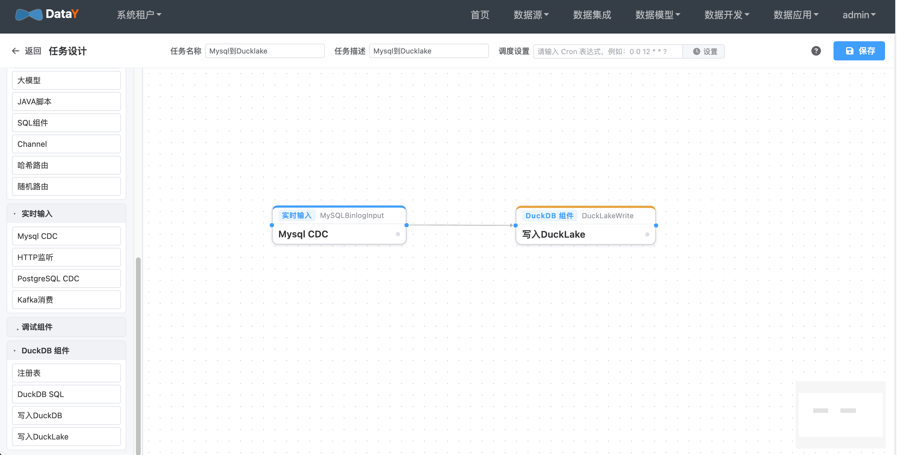

# MySQL 实时入湖 DuckLake 实战：Binlog CDC 原理、任务配置与同步优化

MySQL 里的业务数据一刻不停地变，而报表、分析、AI 需要的是一份「近实时」的数据副本。

把变更实时同步进数据湖，听起来不难，真做起来却有两个绕不开的坎：**怎样低延迟、不丢数地捕获变更？**
以及**源端高频的小事务，怎样才不会在湖里堆出一地小文件？**

下面这条 **MySQL Binlog → DuckLake** 的链路，从原理、配置到同步优化，一次讲清楚。

## 1. 场景说明

本案例演示如何基于 DataY「轻量数据平台」将 MySQL 的数据变更（CDC）实时同步到 **DuckLake** 数据湖。

- **数据源**：MySQL（Binlog，`binlog_format=ROW`）
- **CDC 输入组件**：`MySQLBinlogInput`
- **输出组件**：`DuckLakeWrite`（`model=auto`）
- **同步模式**：按事件类型自动选择写入策略（INSERT / UPDATE / DELETE）

> **重要**：DuckLake 不支持主键 / 唯一约束，UPDATE / DELETE 依赖完整变更前镜像。
> 因此源库必须设置 **`binlog_row_image=FULL`**（等价于 PostgreSQL 的 `REPLICA IDENTITY FULL`）。

> 注意：Binlog 只捕获组件启动之后的**增量**变更；存量数据请先用 `StreamJdbcInput` 做一次全量同步。
> 也可直接在 CDC 组件上开启 `snapshot=true`，首次运行时自动“先全量、后增量”（无断点时才执行）。

## 2. DuckLake 简介

### 2.1 什么是 DuckLake

DuckLake 是 DuckDB Labs 提出的**开放湖仓（Lakehouse）格式**及其官方 DuckDB 扩展。它的核心设计是
**把「元数据」和「数据」彻底分离**：

- **元数据（Catalog）**：存放在一个标准关系数据库中，支持 **DuckDB / SQLite / PostgreSQL / MySQL** 作为元数据库；
- **数据（Data）**：以 **Parquet** 文件形式存放在本地目录或对象存储（S3 / MinIO）中。

相比传统湖仓（如 Iceberg / Delta），DuckLake **不需要独立的 catalog 服务**（Hive Metastore、REST Catalog
等）：元数据就是普通的关系表，直接复用关系数据库的事务与 ACID 能力，也可以用 SQL 直接查询和运维。

### 2.2 核心能力

| 能力 | 说明 |
| --- | --- |
| ACID 事务 | 由元数据库保证，快照式提交 |
| 时间旅行 | `AT (VERSION => ...)` 查询历史快照 |
| Schema 演进 | 支持加列 / 删列 / 改类型等，历史数据自动兼容 |
| 数据分区 | 按分区列组织文件，提升查询裁剪效率 |
| 数据内联（Data Inlining） | 小批量写入直接落在元数据表，避免产生小文件（详见后文「同步过程中的优化措施」） |
| 多引擎读取 | DuckDB、Spark、Trino、DataFusion、`pg_ducklake` 等 |
| “多人 DuckDB” | 多个进程可同时读写同一数据集（DuckDB 原生单文件不支持） |

## 3. MySQL CDC 机制

`MySQLBinlogInput` 底层基于 MySQL 原生的 **Binlog（二进制日志）** 能力，以「伪装从库」的方式直接消费
Binlog 事件流，不依赖 Kafka / Debezium / Canal 等外部组件。理解以下几个概念，就能理解整条链路。

### 3.1 Binlog 与 ROW 模式

MySQL 所有修改在提交前都会写入 **Binlog**。只有当 `binlog_format=ROW` 时，Binlog 才记录**每一行**的
前后镜像，而不是 SQL 语句本身——这是 CDC 能做「按行同步」的前提。

组件使用 `mysql-binlog-connector-java` 实现 Binlog 协议客户端：以从库身份注册（可配置
`serverId`，默认 `1000`）并发送 `COM_BINLOG_DUMP` 命令，持续拉取并解析事件流，再还原成逻辑的
`INSERT / UPDATE / DELETE` 下发给下游。

### 3.2 四个关键对象

| 对象 | 作用 | DataY 的处理 |
| --- | --- | --- |
| **binlog file + position** | Binlog 位点，即“消费到哪了” | 随数据流持久化，任务重启自动从上次位点续传 |
| **`binlog_format=ROW`** | 只有 ROW 才有行级前后镜像 | 按行解析为 INSERT / UPDATE / DELETE 事件 |
| **`binlog_row_image`** | 决定事件中记录哪些列 | DuckLake 无主键，必须设为 `FULL` 才能拿到完整前镜像 |
| **`server-id`** | 伪装成从库的唯一标识 | 组件默认使用 `server-id=1000`，可通过组件参数 `serverId` 调整，需确保该 id 未被其它从库占用 |

### 3.3 Binlog 事件流

组件按事件类型逐条解析，典型顺序如下：

```
FORMAT_DESCRIPTION ──▶ TABLE_MAP ──▶ WRITE_ROWS / UPDATE_ROWS / DELETE_ROWS ──▶ XID ──▶ ROTATE
```

- `FORMAT_DESCRIPTION` 描述 Binlog 版本等格式信息；
- `TABLE_MAP` 把 Binlog 内部的 tableId 映射到真实的库表，组件据此**回源库读一次表结构**并缓存；
- `WRITE_ROWS`（含 `EXT_` / `PRE_GA_` 变体）携带 after image，`UPDATE_ROWS` 同时携带 before / after image，
  `DELETE_ROWS` 携带 before image；
- `XID` 表示事务提交，此时强制刷新缓冲区，把该事务内的变更**成批**下发下游；
- `ROTATE` 表示 Binlog 文件切换，组件同步更新当前位点；
- `QUERY` 事件携带 DDL（如 `ALTER TABLE`），按库 / 表过滤后透传给下游。

### 3.4 实现要点

1. **单连接采集**：一个 Binlog 协议连接即可完成采集，无需部署中间件，也不占用源库的 SQL 连接做轮询；
2. **协议解析**：按事件的 `includedColumns` 位图把列编号映射为列名；`CHAR / BINARY` 统一按字节数组反序列化，
   避免二进制列（`VARBINARY / BINARY`）被按字符编码解码而丢数据；
3. **事件合并**：相邻的**同库、同表、同类型**事件自动合并成一个 FlowFile（上限 10000 条），减少下游小批量写入；
4. **断点续传**：`binlogFile` / `binlogPosition` 随 FlowFile 持久化，任务重启后自动续传；也可显式指定起始位点重放；
5. **库表过滤**：`databaseNamePattern`（库名正则）、`tableNamePattern`（表名正则）只采集关心的库表，DDL 同样按此过滤；
6. **DDL 透传**：`QUERY` 事件中的 DDL 在 `model=auto` 下由 `DuckLakeWrite` 在目标端执行（这一点与 PostgreSQL 逻辑复制不同）。

### 3.5 首次全量快照（snapshot）

开启 `snapshot=true` 后，组件首次运行（无断点、未完成快照）会：

1. 先查询并记录**当前 Binlog 位点**（MySQL 8.4+ 使用 `SHOW BINARY LOG STATUS`，旧版本回退 `SHOW MASTER STATUS`）作为增量起点；
2. 对 `databaseNamePattern` + `tableNamePattern` 范围内的表做一次性全量读取（单个 `REPEATABLE READ` 事务），
   按 `snapshotFetchSize` 分批以 `INSERT` 事件下发；
3. 再从步骤 1 记录的位点启动 Binlog 增量同步，快照窗口内的变更由增量流补放，保证不丢数；
4. 完成后写入 `snapshotDone` 标记，重启不会重复全量。

## 4. 环境准备

### 4.1 开启 MySQL Binlog

```ini
# my.cnf / my.ini
[mysqld]
server-id                  = 1
log-bin                    = /var/log/mysql/mysql-bin
binlog_format              = ROW
binlog_row_image           = FULL
binlog_expire_logs_seconds = 604800
```

```sql
-- 修改后重启 MySQL
SHOW VARIABLES LIKE 'log_bin';            -- 期望 ON
SHOW VARIABLES LIKE 'binlog_format';      -- 期望 ROW（MySQL 8.0 默认 ROW）
SHOW VARIABLES LIKE 'binlog_row_image';   -- 期望 FULL（UPDATE/DELETE 需要完整前镜像）
```

### 4.2 授予复制权限并建表

```sql
-- 采集账号：需要复制权限，快照 / 表结构读取还需要 SELECT
CREATE USER IF NOT EXISTS 'datay'@'%' IDENTIFIED BY 'Datay@123456';
GRANT SELECT, REPLICATION SLAVE, REPLICATION CLIENT ON *.* TO 'datay'@'%';
FLUSH PRIVILEGES;

CREATE DATABASE IF NOT EXISTS test DEFAULT CHARACTER SET utf8mb4;
CREATE TABLE test.cdc_demo (
    id          bigint PRIMARY KEY,
    name        varchar(100),
    amount      decimal(10,2),
    updated_at  datetime
);
```

### 4.3 DuckLake 准备

DuckDB 会自动 `INSTALL/LOAD ducklake` 扩展（需可联网或已缓存扩展）。本案例使用本地路径：

- 元数据文件：`./target/cdc-mysql.ducklake`
- 数据目录：`./target/cdc-mysql-ducklake-data`

## 5. 任务配置与执行

创建 `mysqlCdcToDuckLake.json`：

```json
{
  "units": [
    {
      ".id": "MySQLBinlogInput",
      ".name": "MySQLBinlogInput",
      "sourceId": {
        "url": "jdbc:mysql://127.0.0.1:3306/test?useSSL=false&allowPublicKeyRetrieval=true&serverTimezone=Asia/Shanghai",
        "driver": "com.mysql.cj.jdbc.Driver",
        "username": "datay",
        "password": "Datay@123456",
        "dbschema": "test"
      },
      "databaseNamePattern": "test",
      "tableNamePattern": "cdc_demo"
    },
    {
      ".id": "DuckLakeWrite",
      ".name": "DuckLakeWrite",
      "sourceId": {
        "url": "ducklake:./target/cdc-mysql.ducklake",
        "driver": "org.duckdb.DuckDBDriver",
        "dbschema": "main",
        "extraParams": {
          "s3.data_path": "./target/cdc-mysql-ducklake-data"
        }
      },
      "schema": "main",
      "table": "",
      "model": "auto"
    }
  ],
  "connections": [
    {
      "sourceId": "MySQLBinlogInput",
      "targetId": "DuckLakeWrite",
      "sourcePort": 0
    }
  ],
  "version": "1.0.0"
}
```

> 若数据目录换成对象存储，`s3.data_path` 写 `s3://bucket/path`，并补充 `s3.key_id`、`s3.secret`、
> `s3.endpoint`、`s3.url_style`、`s3.use_ssl` 等参数。

构建并启动任务：

```bash
mvn clean package -DskipTests

java -jar datay-core/target/datay-core-1.0.0-SNAPSHOT-jar-with-dependencies.jar mysqlCdcToDuckLake.json
```

任务启动后组件会以配置的 `serverId`（默认 `1000`）连接 MySQL 并从当前（或上次提交）位点实时读取 Binlog；首次写入时
`DuckLakeWrite` 会按源表结构在 DuckLake 中自动建表（不创建主键 / 唯一约束）。

## 6. 基于 DataY Web 界面配置任务

如果不想手写 JSON，也可以直接在 DataY Web 可视化平台里配置，保存后平台会自动生成与上一节等价的
任务 JSON（`units` + `connections`），交由引擎执行。

**新建 ETL 任务**：进入「数据集成 / ETL 任务 → 新建任务」，从组件面板拖拽 `MySQLBinlogInput`
   与 `DuckLakeWrite` 到画布并连线。

   

## 7. 验证同步效果

在源库执行：

```sql
INSERT INTO test.cdc_demo VALUES (1, 'alice', 10.50, '2024-01-01 10:00:00');
INSERT INTO test.cdc_demo VALUES (2, 'bob',   20.00, '2024-01-02 11:00:00');
UPDATE test.cdc_demo SET name = 'alice2', amount = 11.11 WHERE id = 1;
DELETE FROM test.cdc_demo WHERE id = 2;
```

DuckLake 结果：

```
id | name   | amount | updated_at
1  | alice2 | 11.11  | 2024-01-01 10:00:00
```

### 自动化的端到端测试

```bash
mvn -pl datay-core test -Dtest=MysqlCdcToDuckLakeTest
```

测试覆盖 INSERT / UPDATE / DELETE，并校验 `datetime` 字段墙上时间保持一致。

## 8. 同步过程中的优化措施

### 8.1 小文件从何而来

DuckLake 的数据以 Parquet 文件落在数据目录。默认情况下，**每个快照（每次提交）的插入都会写出新的
Parquet 文件**。CDC 场景如果高频、小批量提交，就会在数据目录里堆积大量只有几行、几十行的碎片文件，
进而拖慢查询与元数据维护。控制小文件需要 **采集侧**与 **DuckLake 侧**配合。

### 8.2 采集侧：从源头减少提交次数与数据量

采集链路里已经做了几件事，降低下游的写入频率、批大小与无效开销：

- **按事务刷新**：解析到 `XID`（事务提交）时才刷新缓冲，把整个事务作为一个批次下发，而不是一行一次；
- **事件合并**：相邻的**同库、同表、同类型**事件会合并成一个 FlowFile（上限 10000 条），把高频小变更“攒”成大批次；
- **库 / 表过滤**：`databaseNamePattern` + `tableNamePattern` 只采集需要的库表，避免把无关变更带到下游；
- **表结构元数据缓存**：`TABLE_MAP` 事件只在首次回源库读取表结构，之后按 `tableId` 复用缓存，避免每条事件都查源库；
- **快照只做一次 + 分批**：全量快照按 `snapshotFetchSize`（默认 10000）分批下发，并以 `snapshotDone` 标记保证重启不重复全量；
- **断点续传**：位点随数据流持久化，进程重启从上次提交位点续传，避免重复同步造成的重复写入；
- **INSERT 多值写入**：`DuckLakeWrite` 对 INSERT 使用多值 `INSERT INTO ... VALUES (...), (...)`，单次落盘的有效行数更多。

> 实践建议：合理控制源端事务粒度。**把大量小事务合并成较大的事务**提交，是减少小文件最直接的手段。

### 8.3 DuckLake 侧：数据内联 + 定期压实

#### （1）数据内联（Data Inlining）

DuckLake **默认开启数据内联，行数阈值为 10**：影响行数小于 `data_inlining_row_limit` 的插入 / 删除会直接
写进元数据表，**根本不产生 Parquet 文件**。这对 CDC 的零星变更非常友好。

可以按需提高阈值（阈值内的写入不再产生文件）：

```sql
-- 方式一：持久化到元数据（推荐），粒度可到表 / schema / 全局
CALL ducklake.set_option('data_inlining_row_limit', 2000, table_name => 'cdc_demo');
CALL ducklake.set_option('data_inlining_row_limit', 5000, schema => 'main');

-- 方式二：ATTACH 时指定（仅当前连接有效）
-- ATTACH 'ducklake:./target/cdc-mysql.ducklake' AS ducklake
--     (data_path './target/cdc-mysql-ducklake-data', DATA_INLINING_ROW_LIMIT 5000);

-- 方式三：DuckDB 全局默认（仅当前会话）
-- SET ducklake_default_data_inlining_row_limit = 5000;
```

> 提醒：写入组件使用连接池，**会话级设置不保证跨连接生效**，请优先使用方式一的
> 持久化选项（写入元数据，任何连接都生效）。

#### （2）把内联数据刷成 Parquet

内联数据长期留在元数据库会增大 catalog、影响查询。可定期刷盘：

```sql
CALL ducklake_flush_inlined_data('ducklake', schema_name => 'main');
-- 或指定表
CALL ducklake_flush_inlined_data('ducklake', table_name => 'cdc_demo');
```

### 8.4 运维侧：让链路长期稳定

- **控制事务粒度**：源端大批量操作尽量合并提交，减少下游写入次数；
- **Binlog 保留时长要覆盖最长停机时间**：`binlog_expire_logs_seconds` 过短会导致任务长时间停机后位点失效，
  只能重新全量；建议保留 7 天以上；
- **位点稳定**：不要随意清理源库 Binlog 或更换采集账号，否则断点续传可能失效；
- **定期维护**：结合 `ducklake_flush_inlined_data` 与 `ducklake_merge_adjacent_files` 做周期性压实。

## 9. 写入策略说明（DuckLake）

| 事件 | 写入策略 |
|------|----------|
| INSERT | 多值 `INSERT INTO ... VALUES (...), (...)` |
| UPDATE | `UPDATE ... SET ... WHERE <变更前镜像所有列>`（DuckLake 无主键） |
| DELETE | `DELETE ... WHERE <变更前镜像所有列>` |

> 依赖 `binlog_row_image=FULL` 提供完整前镜像；若为 `MINIMAL`，UPDATE / DELETE 只带主键列，
> 而 DuckLake 无主键，将无法按全列匹配，可能出现更新不到或产生重复行。
> 与 PostgreSQL 逻辑复制不同，MySQL 的 DDL 会随 `QUERY` 事件**自动透传**到 DuckLake 执行；
> 由于是原样执行，含 MySQL 特有语法（反引号、`ENGINE=InnoDB`、`AUTO_INCREMENT` 等）的语句可能需要人工处理。

## 10. 组件参数速查

`MySQLBinlogInput`：

| 参数 | 必填 | 说明 |
|------|------|------|
| `datasource` | ✅ | MySQL 连接信息（url/username/password/dbschema） |
| `databaseNamePattern` | ❌ | 库名过滤正则，为空回退数据源 `dbschema` |
| `tableNamePattern` | ❌ | 表名过滤正则，为空采集全部 |
| `binlogFile` | ❌ | 指定起始 Binlog 文件，缺省从上次提交位点续传 |
| `binlogPosition` | ❌ | 指定起始位点，与 `binlogFile` 配合使用 |
| `snapshot` | ❌ | 首次运行是否先全量后增量，默认 `false` |
| `snapshotFetchSize` | ❌ | 快照分批大小，默认 `10000` |

`DuckLakeWrite`：

| 参数 | 必填 | 说明 |
|------|------|------|
| `datasource.url` | ✅ | `ducklake:<元数据位置>` |
| `datasource.extraParams["s3.data_path"]` | ✅ | 数据目录，本地目录或 `s3://` |
| `schema` | ❌ | DuckLake schema，缺省取数据源 `dbschema` |
| `table` | ❌ | 目标表，留空按上游表名自动建表 |
| `model` | ❌ | `auto`（按事件自动）/ `append` / `update` / `replace` / `overwrite` |

## 11. 常见问题

- **UPDATE / DELETE 未生效或产生重复行**：确认源库已设置 `binlog_row_image=FULL`。
- **DuckLake 不支持 PRIMARY KEY / UNIQUE**：建表自动不创建主键，属预期行为。
- **`INSERT OR REPLACE` 报错**：DuckLake 不支持；本组件已改为基于前镜像的 `UPDATE`。
- **启动失败、提示权限不足**：采集账号需要 `REPLICATION SLAVE`、`REPLICATION CLIENT`，快照与表结构读取还需要 `SELECT`；
  使用 MySQL 8 的 `caching_sha2_password` 时，JDBC URL 建议带上 `allowPublicKeyRetrieval=true`。
- **与其它从库冲突**：组件默认使用 `server-id=1000`，可通过 `serverId` 参数调整，请确认该 id 未被占用。
- **扩展安装失败**：确保 DuckDB 可访问扩展源或已缓存 `ducklake` 扩展。
- **只同步到启动后的变更**：存量数据请另行全量同步，或开启 `snapshot=true`。
- **数据目录出现大量小文件**：提高 `data_inlining_row_limit`，并定期执行
  `ducklake_flush_inlined_data` + `ducklake_merge_adjacent_files`（见「同步过程中的优化措施」）。
- **断点续传**：位点随数据流持久化，重启自动续传；如需重放，可显式指定 `binlogFile` / `binlogPosition`。

## 12. 关于 DataY

读到这里，你或许会好奇：上面的采集组件、可视化配置与定期维护任务，究竟由谁提供？

答案就是 **DataY**——一套极致轻量、高性能的一体化数据平台：一个 JAR、内嵌 DuckDB，在 **2 核 4G**
的机器上，就能跑通 **数据集成 → 维度建模 → 任务调度 → 高性能数仓 → 智能问数** 的完整链路。

| 模块 | 定位 | 说明                                                                              |
| --- | --- |---------------------------------------------------------------------------------|
| **DataY Core** | 数据集成引擎 | 轻量、可嵌入、流批一体；内置 DuckDB；支持 JSON 定义任务、自动建表、MySQL / PostgreSQL CDC 实时同步、DuckLake 写入 |
| **DataY Web** | 可视化数据平台 | 基于 DataY Core 构建，提供拖拽式 ETL 设计、分布式调度、维度建模、指标管理与智能问数                              |

核心特征：

- **一个 JAR 启动**：Web 平台内嵌 Core 引擎，无需额外部署计算 / 存储组件
- **多种数据源**：MySQL、PostgreSQL、Oracle、Doris、ClickHouse、DuckDB 等，支持全量 / 增量 / CDC 实时同步
- **流批一体**：同一套组件同时支持批处理与流式处理
- **数据湖**：支持写入 DuckLake，低成本构建轻量数据湖
- **分布式调度**：单机 `standalone` 即可跑通全链路，同时支持分布式部署

本文涉及的 `MySQLBinlogInput` 与 `DuckLakeWrite` 都来自 DataY Core：写成 JSON 交给命令行即可运行，
也可以在 DataY Web 里拖拽画布可视化编排、配置 Cron 调度、监控任务实例。

- 产品首页：http://datay.yuyuejia.com.cn/
- 源码仓库：https://github.com/yuyuejia/datay
