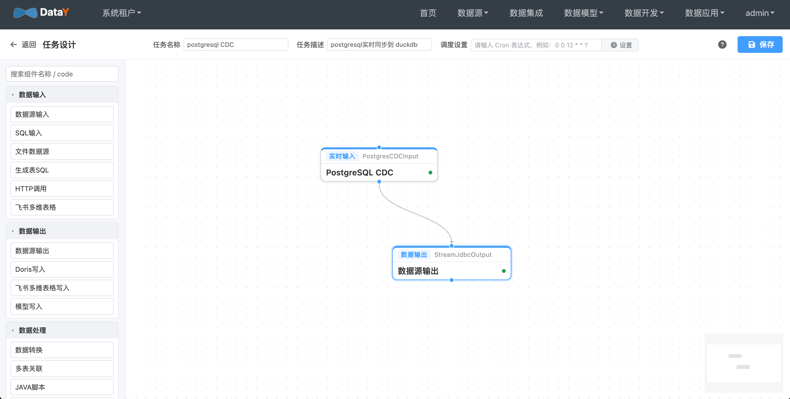

# PostgreSQL 实时入湖 DuckLake 实战：CDC 原理、任务配置与小文件治理

PostgreSQL 里的业务数据一刻不停地变，而报表、分析、AI 需要的是一份「近实时」的数据副本。

把变更实时同步进数据湖，听起来不难，真做起来却有两个绕不开的坎：**怎样低延迟、不丢数地捕获变更？**
以及**源端高频的小事务，怎样才不会在湖里堆出一地小文件？**

下面这条 **PostgreSQL 逻辑复制 → DuckLake** 的链路，从原理、配置到小文件治理，一次讲清楚。

## 1. 场景说明

本案例演示如何基于 DataY「轻量数据平台」将 PostgreSQL 的数据变更（CDC）实时同步到 **DuckLake** 数据湖。

- **数据源**：PostgreSQL（逻辑复制 / WAL + `pgoutput`）
- **CDC 输入组件**：`PostgresCDCInput`
- **输出组件**：`DuckLakeWrite`（`model=auto`）
- **同步模式**：按事件类型自动选择写入策略（INSERT / UPDATE / DELETE）

> **重要**：DuckLake 不支持主键 / 唯一约束，UPDATE / DELETE 依赖完整变更前镜像。
> 因此源表必须设置 **`REPLICA IDENTITY FULL`**（等价于 MySQL 的 `binlog_row_image=FULL`）。

> 注意：逻辑复制只捕获组件启动之后的**增量**变更；存量数据请先用 `StreamJdbcInput` 做一次全量同步。
> 也可直接在 CDC 组件上开启 `snapshot=true`，首次运行时自动“先全量、后增量”（无断点时才执行）。

## 2. DuckLake 简介

### 2.1 什么是 DuckLake

DuckLake 是 DuckDB Labs 提出的**开放湖仓（Lakehouse）格式**及其官方 DuckDB 扩展。它的核心设计是
**把「元数据」和「数据」彻底分离**：

- **元数据（Catalog）**：存放在一个标准关系数据库中，支持 **DuckDB / SQLite / PostgreSQL / MySQL** 作为元数据库；
- **数据（Data）**：以 **Parquet** 文件形式存放在本地目录或对象存储（S3 / MinIO）中。

相比传统湖仓（如 Iceberg / Delta），DuckLake **不需要独立的 catalog 服务**（Hive Metastore、REST Catalog
等）：元数据就是普通的关系表，直接复用关系数据库的事务与 ACID 能力，也可以用 SQL 直接查询和运维。

### 2.2 核心能力

| 能力 | 说明 |
| --- | --- |
| ACID 事务 | 由元数据库保证，快照式提交 |
| 时间旅行 | `AT (VERSION => ...)` 查询历史快照 |
| Schema 演进 | 支持加列 / 删列 / 改类型等，历史数据自动兼容 |
| 数据分区 | 按分区列组织文件，提升查询裁剪效率 |
| 数据内联（Data Inlining） | 小批量写入直接落在元数据表，避免产生小文件（详见后文「减少实时同步小文件的优化」） |
| 多引擎读取 | DuckDB、Spark、Trino、DataFusion、`pg_ducklake` 等 |
| “多人 DuckDB” | 多个进程可同时读写同一数据集（DuckDB 原生单文件不支持） |

## 3. PostgreSQL CDC 机制

`PostgresCDCInput` 底层基于 PostgreSQL 原生的**逻辑复制**能力，不依赖 Kafka / Debezium 等外部组件。理解以下
几个概念，就能理解整条链路。

### 3.1 WAL 与逻辑复制

PostgreSQL 所有修改在提交前都会先写入 **WAL（Write-Ahead Log，预写日志）**。当
`wal_level=logical` 时，WAL 会保留足够信息，允许通过**逻辑解码**把物理日志还原成逻辑的
`INSERT / UPDATE / DELETE` 事件。逻辑复制就是“持续消费这些解码事件”的机制。

### 3.2 四个关键对象

| 对象 | 作用 | DataY 的处理 |
| --- | --- | --- |
| **publication**（发布） | 声明哪些表的变更需要发布 | 按 `schema` + `tableNamePattern` 自动 `CREATE / ALTER PUBLICATION ... FOR TABLE` |
| **replication slot**（复制槽） | 记录消费位点，防止 WAL 被过早回收（避免丢数据） | 不存在时自动创建，输出插件固定为 `pgoutput` |
| **LSN**（Log Sequence Number） | WAL 位点，即“消费到哪了” | 随数据流持久化，任务重启自动从上次位点续传 |
| **REPLICA IDENTITY** | 决定 UPDATE / DELETE 时旧元组记录哪些列 | DuckLake 无主键，必须设为 `FULL` 才能拿到完整前镜像 |

### 3.3 pgoutput 消息流

组件内置 `pgoutput` 协议解析器，按事务读取并解析以下消息：

```
Begin ──▶ Relation ──▶ Insert / Update / Delete ──▶ ... ──▶ Commit
```

- `Relation` 描述表结构，用于把列编号映射为列名；
- `Insert` 携带 after image，`Update` / `Delete` 携带 before image（`Update` 同时有 after image）；
- `Commit` 表示事务结束，此时才把缓冲区内的数据成批下发下游，并把确认位点回传服务端。

### 3.4 实现要点

1. **双连接**：一条普通连接维护表元数据、publication、slot；另一条带 `replication=database` 的连接读取 WAL；
2. **协议解析**：`PgOutputDecoder` 按列名生成 before / after 数据，并做基础类型转换；
3. **事件合并**：相邻的**同表、同类型**事件自动合并成一个 FlowFile（上限 10000 条），减少下游小批量写入；
4. **断点续传**：提交位点（LSN）随 FlowFile 持久化，重启后自动续传；
5. **表级过滤**：`tableNamePattern` 支持正则，只采集关心的表。

### 3.5 首次全量快照（snapshot）

开启 `snapshot=true` 后，组件首次运行（无断点、未完成快照）会：

1. 先创建 publication 与 replication slot，并取 slot 一致点作为增量起点（保证增量不丢）；
2. 对 `schema` + `tableNamePattern` 范围内的表做一次性全量读取（`REPEATABLE READ` 单事务），按 `snapshotFetchSize` 分批下发；
3. 再从一致点启动逻辑复制增量同步；
4. 完成后写入 `snapshotDone` 标记，重启不会重复全量。

## 4. 环境准备

### 4.1 开启 PostgreSQL 逻辑复制

```sql
-- 超级用户执行
ALTER SYSTEM SET wal_level = logical;
-- 修改后重启 PostgreSQL
SHOW wal_level;  -- 期望 logical

-- 采集账号授权
ALTER ROLE admin WITH REPLICATION;
```

### 4.2 创建源表并设置完整前镜像

```sql
CREATE TABLE public.cdc_demo (
    id          bigint PRIMARY KEY,
    name        varchar(100),
    amount      numeric(10,2),
    updated_at  timestamp
);

-- DuckLake 无主键，UPDATE/DELETE 需要完整变更前镜像
ALTER TABLE public.cdc_demo REPLICA IDENTITY FULL;
```

### 4.3 DuckLake 准备

DuckDB 会自动 `INSTALL/LOAD ducklake` 扩展（需可联网或已缓存扩展）。本案例使用本地路径：

- 元数据文件：`./target/cdc-pg.ducklake`
- 数据目录：`./target/cdc-pg-ducklake-data`

## 5. 任务配置与执行

创建 `postgresCdcToDuckLake.json`：

```json
{
  "units": [
    {
      ".id": "PostgresCDCInput",
      ".name": "PostgresCDCInput",
      "sourceId": {
        "url": "jdbc:postgresql://127.0.0.1:5432/testdb",
        "driver": "org.postgresql.Driver",
        "username": "admin",
        "password": "123456",
        "dbschema": "public"
      },
      "schema": "public",
      "tableNamePattern": "cdc_demo",
      "publicationName": "datay_pub_cdc_demo_lake",
      "slotName": "datay_slot_cdc_demo_lake"
    },
    {
      ".id": "DuckLakeWrite",
      ".name": "DuckLakeWrite",
      "sourceId": {
        "url": "ducklake:./target/cdc-pg.ducklake",
        "driver": "org.duckdb.DuckDBDriver",
        "dbschema": "main",
        "extraParams": {
          "s3.data_path": "./target/cdc-pg-ducklake-data"
        }
      },
      "schema": "main",
      "table": "",
      "model": "auto"
    }
  ],
  "connections": [
    {
      "sourceId": "PostgresCDCInput",
      "targetId": "DuckLakeWrite",
      "sourcePort": 0
    }
  ],
  "version": "1.0.0"
}
```

> 若数据目录换成对象存储，`s3.data_path` 写 `s3://bucket/path`，并补充 `s3.key_id`、`s3.secret`、
> `s3.endpoint`、`s3.url_style`、`s3.use_ssl` 等参数。

构建并启动任务：

```bash
mvn clean package -DskipTests

java -jar datay-core/target/datay-core-1.0.0-SNAPSHOT-jar-with-dependencies.jar postgresCdcToDuckLake.json
```

任务启动后组件会自动创建 publication 与复制槽，并从当前 WAL 位点开始实时读取变更。

## 6. 基于 DataY Web 界面配置任务

如果不想手写 JSON，也可以直接在 DataY Web 可视化平台里配置，保存后平台会自动生成与上一节等价的
任务 JSON（`units` + `connections`），交由引擎执行。

**新建 ETL 任务**：进入「数据集成 / ETL 任务 → 新建任务」，从组件面板拖拽 `PostgresCDCInput`
   与 `DuckLakeWrite` 到画布并连线。

   

## 7. 验证同步效果

在源库执行：

```sql
INSERT INTO public.cdc_demo VALUES (1, 'alice', 10.50, '2024-01-01 10:00:00');
INSERT INTO public.cdc_demo VALUES (2, 'bob',   20.00, '2024-01-02 11:00:00');
UPDATE public.cdc_demo SET name = 'alice2', amount = 11.11 WHERE id = 1;
DELETE FROM public.cdc_demo WHERE id = 2;
```

DuckLake 结果：

```
id | name   | amount | updated_at
1  | alice2 | 11.11  | 2024-01-01 10:00:00
```

## 8. 减少实时同步小文件的优化

### 8.1 小文件从何而来

DuckLake 的数据以 Parquet 文件落在数据目录。默认情况下，**每个快照（每次提交）的插入都会写出新的
Parquet 文件**。CDC 场景如果高频、小批量提交，就会在数据目录里堆积大量只有几行、几十行的碎片文件，
进而拖慢查询与元数据维护。控制小文件需要 **采集侧**与 **DuckLake 侧**配合。

### 8.2 采集侧：从源头减少提交次数

采集链路里已经做了几件事，降低下游的写入频率和批大小：

- **按事务刷新**：PostgreSQL CDC 在读到 `Commit` 时才把整个事务作为一个批次下发，而不是一行一次；
- **事件合并**：相邻的**同表、同类型**事件会合并成一个 FlowFile（上限 10000 条），把高频小变更“攒”成大批次；
- **快照分批**：全量快照按 `snapshotFetchSize`（默认 10000）分批，避免一次写入过大或过小；
- **INSERT 多值写入**：`DuckLakeWrite` 对 INSERT 使用多值 `INSERT INTO ... VALUES (...), (...)`，单次落盘的有效行数更多。

> 实践建议：合理控制源端事务粒度。**把大量小事务合并成较大的事务**提交，是减少小文件最直接的手段。

### 8.3 DuckLake 侧：数据内联 + 定期压实

#### （1）数据内联（Data Inlining）

DuckLake **默认开启数据内联，行数阈值为 10**：影响行数小于 `data_inlining_row_limit` 的插入 / 删除会直接
写进元数据表，**根本不产生 Parquet 文件**。这对 CDC 的零星变更非常友好。

可以按需提高阈值（阈值内的写入不再产生文件）：

```sql
-- 方式一：持久化到元数据（推荐），粒度可到表 / schema / 全局
CALL ducklake.set_option('data_inlining_row_limit', 2000, table_name => 'cdc_demo');
CALL ducklake.set_option('data_inlining_row_limit', 5000, schema => 'main');

-- 方式二：ATTACH 时指定（仅当前连接有效）
-- ATTACH 'ducklake:./target/cdc-pg.ducklake' AS ducklake
--     (data_path './target/cdc-pg-ducklake-data', DATA_INLINING_ROW_LIMIT 5000);

-- 方式三：DuckDB 全局默认（仅当前会话）
-- SET ducklake_default_data_inlining_row_limit = 5000;
```

> 提醒：写入组件使用连接池，**会话级设置不保证跨连接生效**，请优先使用方式一的
> 持久化选项（写入元数据，任何连接都生效）。

#### （2）把内联数据刷成 Parquet

内联数据长期留在元数据库会增大 catalog、影响查询。可定期刷盘：

```sql
CALL ducklake_flush_inlined_data('ducklake', schema_name => 'main');
-- 或指定表
CALL ducklake_flush_inlined_data('ducklake', table_name => 'cdc_demo');
```

## 9. 写入策略说明（DuckLake）

| 事件 | 写入策略 |
|------|----------|
| INSERT | 多值 `INSERT INTO ... VALUES (...), (...)` |
| UPDATE | `UPDATE ... SET ... WHERE <变更前镜像所有列>`（DuckLake 无主键） |
| DELETE | `DELETE ... WHERE <变更前镜像所有列>` |

> 依赖 `REPLICA IDENTITY FULL` 提供完整前镜像；若为默认（仅主键），UPDATE/DELETE 无法按全列匹配。
> 同 DuckDB 目标一样，PG 逻辑复制**不传输 DDL**，表结构变更需手动处理。

## 10. 组件参数速查

`PostgresCDCInput`：

| 参数 | 必填 | 说明 |
|------|------|------|
| `datasource` | ✅ | PostgreSQL 连接信息（url/username/password/dbschema） |
| `schema` | ❌ | 采集 schema，缺省取 `datasource.dbschema` |
| `tableNamePattern` | ❌ | 表名过滤正则，为空采集全部 |
| `publicationName` | ❌ | publication 名称，缺省自动生成 |
| `slotName` | ❌ | 逻辑复制槽名称，缺省自动生成 |
| `startLsn` | ❌ | 起始 LSN，缺省从槽位确认位点续传 |
| `snapshot` | ❌ | 首次运行是否先全量后增量，默认 `false` |
| `snapshotFetchSize` | ❌ | 快照分批大小，默认 `10000` |

`DuckLakeWrite`：

| 参数 | 必填 | 说明 |
|------|------|------|
| `datasource.url` | ✅ | `ducklake:<元数据位置>` |
| `datasource.extraParams["s3.data_path"]` | ✅ | 数据目录，本地目录或 `s3://` |
| `schema` | ❌ | DuckLake schema，缺省取数据源 `dbschema` |
| `table` | ❌ | 目标表，留空按上游表名自动建表 |
| `model` | ❌ | `auto`（按事件自动）/ `append` / `update` / `replace` / `overwrite` |

## 11. 常见问题

- **UPDATE/DELETE 未生效或产生重复行**：确认源表已设置 `REPLICA IDENTITY FULL`。
- **DuckLake 不支持 PRIMARY KEY/UNIQUE**：建表自动不创建主键，属预期行为。
- **扩展安装失败**：确保 DuckDB 可访问扩展源或已缓存 `ducklake` 扩展。
- **只同步到启动后的变更**：存量数据请另行全量同步，或开启 `snapshot=true`。
- **数据目录出现大量小文件**：提高 `data_inlining_row_limit`，并定期执行
  `ducklake_flush_inlined_data` + `ducklake_merge_adjacent_files`（见「减少实时同步小文件的优化」）。
- **断点续传**：保持 `slotName` 稳定，组件会从上次提交位点续传。

## 12. 关于 DataY

读到这里，你或许会好奇：上面的采集组件、可视化配置与定时维护任务，究竟由谁提供？

答案就是 **DataY**——一套极致轻量、高性能的一体化数据平台：一个 JAR、内嵌 DuckDB，在 **2 核 4G**
的机器上，就能跑通 **数据集成 → 维度建模 → 任务调度 → 高性能数仓 → 智能问数** 的完整链路。

| 模块 | 定位 | 说明 |
| --- | --- | --- |
| **DataY Core** | 数据集成引擎 | 轻量、可嵌入、流批一体；内置 DuckDB；支持 JSON 定义任务、自动建表、MySQL / PostgreSQL CDC 实时同步、DuckLake 写入 |
| **DataY Web** | 可视化数据平台 | 基于 DataY Core 构建，提供拖拽式 ETL 设计、Quartz 调度、维度建模、指标管理与智能问数 |

核心特征：

- **一个 JAR 启动**：Web 平台内嵌 Core 引擎，无需额外部署计算 / 存储组件
- **零依赖运行**：开发默认内嵌 H2，生产可换 MySQL；单机 `standalone` 即可跑通全链路
- **十余种数据源**：MySQL、PostgreSQL、Oracle、Doris、ClickHouse、DuckDB 等，支持全量 / 增量 / CDC 实时同步
- **流批一体**：同一套组件同时支持批处理与流式处理
- **数据湖**：支持写入 DuckLake，低成本构建轻量数据湖

本文涉及的 `PostgresCDCInput` 与 `DuckLakeWrite` 都来自 DataY Core：写成 JSON 交给命令行即可运行，
也可以在 DataY Web 里拖拽画布可视化编排、配置 Cron 调度、监控任务实例。

- 产品首页：http://datay.yuyuejia.com.cn/
- 在线演示：http://datay-demo.yuyuejia.com.cn/
- 源码仓库：https://github.com/yuyuejia/datay

---

通过本案例，你可以快速搭建 PostgreSQL → DuckLake 的实时 CDC 同步链路，并用可视化平台与定期维护
兼顾易用性与长期性能。
