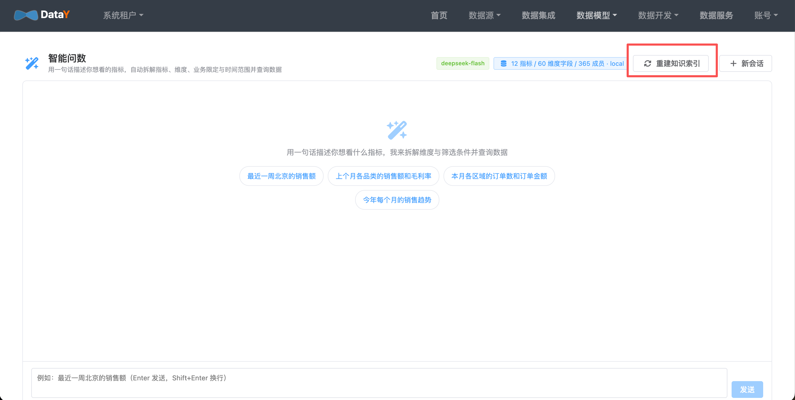
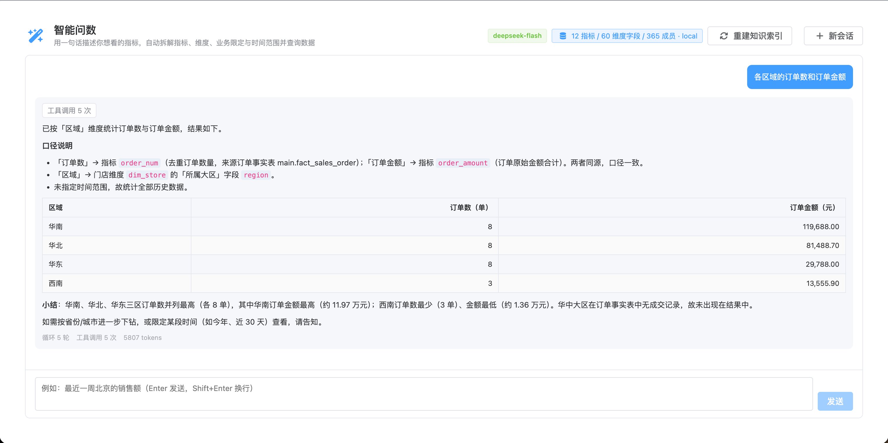

# 智能问数

**目标**：用自然语言直接拿数，不需要会写 SQL。

导航：**数据模型 → 智能问数**。

## 构建知识索引

首次使用点 **「重建知识索引」**，平台会把以下内容向量化：

- 指标（名称 + 编码 + 口径描述）
- 维度字段
- 维度成员值（门店城市、品类名称等）

索引完成后，AI 才能正确理解你的业务语义。



## 开始问数

在输入框里像跟老板说话一样描述需求：

```
各品类的销售额和毛利率
最近一周北京的销售额
每个月的销售额趋势对比
今年一季度 vs 去年一季度的客单价
```

AI 会自动完成：**知识检索 → 指标匹配 → 维度 / 时间识别 → 业务限定解析 → 取数**，
最终用 **Markdown 表格** 给你答案。



## 工作原理

- **RAG 本地向量索引**：把指标、维度、成员值向量化，先检索再推理，指标口径不跑偏
- **指标优先**：命中已定义指标时直接复用其口径，避免口径漂移
- **可解释**：返回结果时附带解析过程（命中的指标、维度、过滤条件）

## 前置条件

- 已配置 AI API Key（`DATAY_AI_API_KEY`），未配置时助手自动降级为不可用，不影响普通查询
- 已完成 [维度建模](guide/modeling.md) 与 [指标管理](guide/metric.md)，并构建过知识索引

## 下一步

- [指标管理](guide/metric.md)：不依赖 AI 的公共指标查询
- [数据集成与同步](guide/integration.md)：把数据准备好再问数
