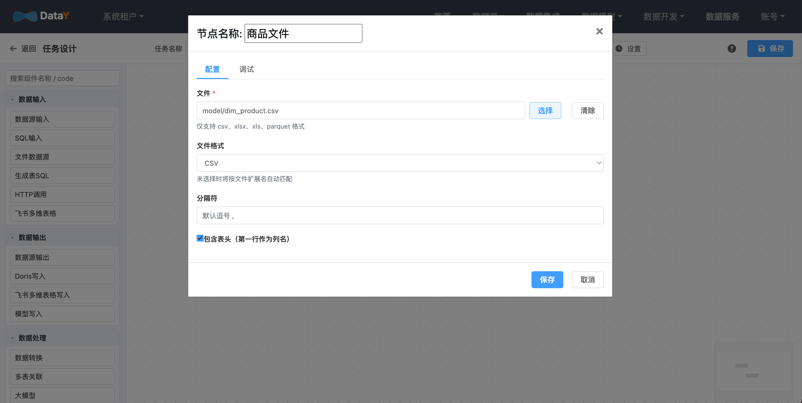

# 数据集成与同步

**目标**：把源数据（文件 / MySQL / API / CDC 等）同步进数仓物理表。

数据接入有两种方式，按任务复杂度二选一：

| 方式 | 适用场景 | 入口 |
| --- | --- | --- |
| 可视化 ETL 画布 | 复杂数据流、多个组件编排 | 数据集成 |
| 数据同步 | 简单的库表同步 | 数据同步 |

## 方式一：可视化 ETL 画布

导航：**数据集成 → 新建任务**。

1. 从组件面板拖拽节点到画布，例如 `FileInput`（或 `StreamJdbcInput`）与 `ModelWrite`。
2. 用连线连接节点，编排数据流方向。
3. 双击节点打开配置弹窗，填写数据源、表、增量列、写入模式等参数。
4. 保存任务，画布会自动生成 DataY Core 可执行的任务 JSON（`units` + `connections`）。

画布支持的组件继承自 DataY Core，完整清单见 [ETL 组件介绍](components/README.md)：

- **输入组件**：`StreamJdbcInput`、`JdbcInput`、`MySQLBinlogInput`、`PostgresCDCInput`
- **处理组件**：`DuckDBSql`、`StreamSqlUnit`、`Join`、`DataTransform`、`JavaScriptComponent`
- **输出组件**：`StreamJdbcOutput`、`DuckDBWrite`、`DuckLakeWrite`、`DorisStreamLoad`、`ModelWrite`
- **其他组件**：`HttpListener`、`GenerateFlowFile`

## 方式二：数据同步

导航：**数据同步**。

1. 选择源数据源与源表。
2. 选择目标数据源与目标表（可自动建表）。
3. 选择同步模式：**全量** 或 **增量**（需指定增量列）。
4. 执行或保存为同步任务。

数据同步会自动完成目标表建表（DDL 转换），源表改字段也会同步到目标。

## 执行与校验

1. 任务「执行一次」，或在任务列表点击「上线」加入调度。
2. 进入 **任务实例** 页查看状态，确认运行成功。

3. 在 **数据源元数据浏览** 中确认目标表已生成且有数据。

## ETL 任务状态管理

ETL 中的有状态组件会把运行状态持久化，任务下次启动时读取恢复，避免重复同步：

- `StreamJdbcInput` / `JdbcInput`：保存增量列水位（`<组件id>.lastIncrValue.<表>`）
- `MySQLBinlogInput`：保存 binlog 文件与位点（`<组件id>.binlogFile`、`<组件id>.binlogPosition`）
- `PostgresCDCInput`：保存 WAL LSN（`<组件id>.binlogPosition`）

状态以 `jobCode`（即 `ETLTask.jobId`）为维度存储，可在「ETL 任务列表 → 状态」中查询、修改、删除。

### 状态存储后端

状态存储配置位于 `dp_service_config` 的 `status-storage` 分组，可在状态管理弹窗的「状态存储配置」中设置：

| 配置 | 说明 | 默认值 |
| --- | --- | --- |
| `type` | `local` 或 `minio` | `local` |
| `local.base-path` | 本地状态目录（单机部署） | `./log` |
| `minio.endpoint` / `minio.access-key` / `minio.secret-key` | MinIO 连接信息 | 空 |
| `minio.bucket-name` | MinIO 桶名 | `datay-status` |

- **单机部署（standalone）**：使用 `local`，状态写入本地 `./log/status_<jobCode>.json`。
- **master / worker 分离部署**：必须使用 `minio`。worker 执行时把状态写入 MinIO，master 通过共享的
  `dp_service_config` 解析到同一 MinIO，因此可在 master 端查询 / 修改 / 删除 worker 的状态。

> 注意：分离部署时若仍使用 `local`，状态只落在各 worker 本地磁盘，master 无法读取，也无法跨节点恢复增量。

## 下一步

- [任务设计与开发](guide/development.md)：了解任务类型与 DAG 编排
- [任务调度与实例](guide/scheduler.md)：把任务配置成定时 / 依赖调度
