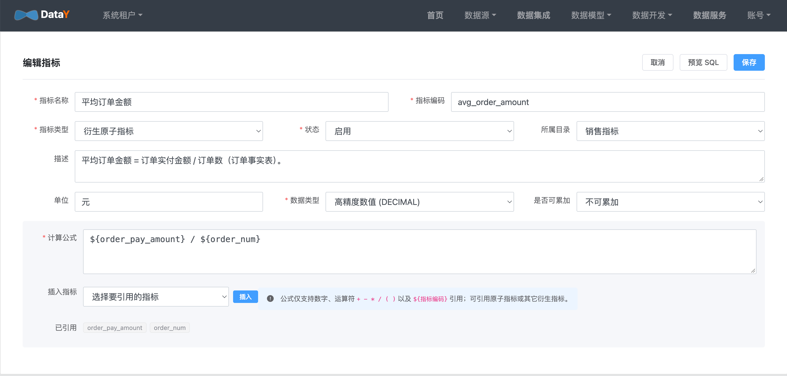
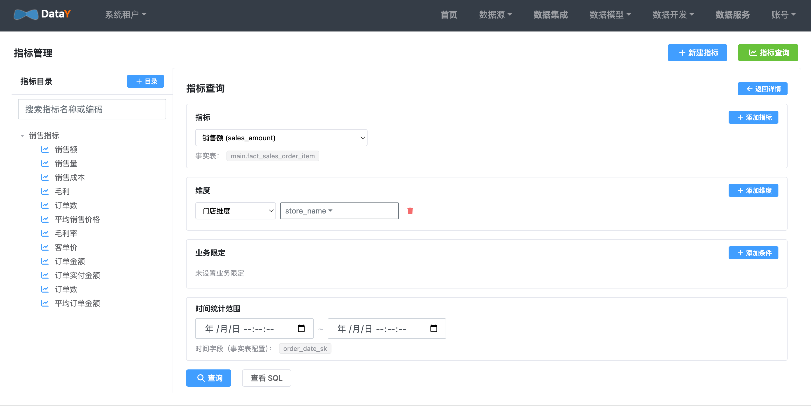

# 指标管理

**目标**：用统一的公式定义业务指标口径，问数有依据、报表对得上。

导航：**数据模型 → 指标管理**。

## 原子指标（基础度量）

1. 新建指标，类型选 **原子指标**。
2. 填名称、编码、单位（如 `销售额 sales_amount`，单位「元」）。
3. 选绑定的事实表（必须是 `DWD` 类型的模型，如电商资产包里的 `fact_sales_order`）。
4. 写计算公式：`SUM(amount)`、`COUNT(DISTINCT order_id)` 等。
5. 可选配置「业务限定」（如只算已支付订单）。
6. 点「预览 SQL」核对口径后保存。


## 衍生指标（组合公式）

类型选 **衍生原子指标**，用 `${指标编码}` 引用已有指标：

```
毛利率 = ${gross_profit} / ${sales_amount}
客单价 = ${sales_amount} / ${order_count}
```



## 指标查询（公共指标面板）

如果你想直接选指标手动查，或需要校验 AI 口径：**指标管理 → 指标查询**。

1. 选指标（可多选，自动求共同维度）。
2. 加维度（层级 / 时间维度可选具体层级）。
3. 设业务限定和时间范围。
4. 预览 SQL 或直接查询。



## 口径一致性

指标是智能问数与公共指标面板的**统一口径来源**：

- 问数时 AI 会优先匹配已定义的指标，而不是凭空生成计算逻辑
- 面板与问数使用同一套定义，保证「报表对得上」

## 下一步

- [智能问数](guide/askdata.md)：用一句话问出指标结果
- [维度建模](guide/modeling.md)：指标依赖的维度与事实模型
