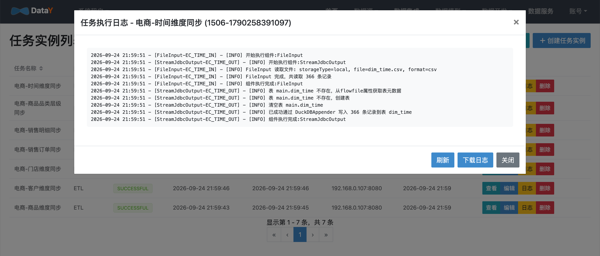

# 任务调度与实例

DataY 基于 **Quartz** 提供定时调度、依赖调度与实例监控能力。

## 调度能力

- **Cron 定时调度**：任务上线后自动注册调度，支持动态上线 / 下线
- **依赖调度**：通过任务依赖（JobDepend）配置父子关系，父任务成功后触发子任务；依赖未满足时实例进入 WAITING 状态，由 WaitingJobQuartzTask 定时轮询恢复
- **手动触发**：支持任务立即执行一次（RUN）
- **失败重试**：运行中的任务支持终止，失败任务可重新执行

## 上线与下线

1. 在任务列表点击「上线」，任务即加入调度。
2. 再次点击「下线」，任务从调度中移除。

只有上线的任务才会按 Cron 规则自动触发。

## 调度部署模式

调度系统由 **master（调度）** 与 **worker（执行）** 两类角色组成，通过 `development.mode`
配置项声明当前进程承担的角色：

| 配置 | 说明 | 调度能力 | 执行能力 | 依赖 Redis |
| --- | --- | --- | --- | --- |
| `standalone` | 单机部署，调度与执行合一（默认） | 有 | 有 | 否 |
| `master` | master 独立部署，只负责调度，不执行任务 | 有 | 无 | 是 |
| `worker` | worker 独立部署，只负责执行任务，不参与调度 | 无 | 有 | 是 |
| `master,worker` | 同一个服务同时具备调度与执行能力 | 有 | 有 | 是 |
| `standalone,worker` | 按单机配置运行，同时额外承担 worker 职能 | 有 | 有 | 是 |

`standalone` 表达的是「单机部署」这一形态，可以和 master / worker 角色组合书写；
只写 `standalone` 时进程内事件不走 Redis，一旦带上 `master` / `worker` 就改用 Redis 事件通道。
多个角色用逗号分隔，分隔符同时支持分号与空格，大小写不敏感。

角色职责划分：

- **master**：初始化 Quartz 调度、维护任务上线 / 下线、接收 worker 上报的任务状态并落库，通过 Redis 队列下发待执行任务
- **worker**：从 Redis 队列消费待执行任务并执行，上报执行状态与日志，不初始化 Quartz 调度
- 多 master 部署时通过 Redis 分布式锁进行 Leader 选举，只有 Leader 负责调度，保证调度一致性

### 启动方式

部署角色统一由 `development.mode` 表达，**不需要额外的 Spring profile**：

```bash
# 单机部署（默认，无需 Redis）
java -jar target/*.jar --spring.profiles.active=prod

# master 独立部署（仅调度，可多副本由 Leader 选举保证唯一性）
java -jar target/*.jar --spring.profiles.active=prod --development.mode=master

# worker 独立部署（仅执行，可水平扩展提升吞吐）
java -jar target/*.jar --spring.profiles.active=prod --development.mode=worker

# 同一个服务同时具备 master 与 worker 职能
java -jar target/*.jar --spring.profiles.active=prod --development.mode=master,worker
```

带 `master` / `worker` 角色的部署需要配置 Redis：

```yaml
spring:
  data:
    redis:
      host: 127.0.0.1
      port: 6379
      password: ''
      database: 0
```

也可以通过环境变量配置：`SPRING_DATA_REDIS_HOST` / `SPRING_DATA_REDIS_PORT` / `SPRING_DATA_REDIS_PASSWORD`，
以及部署角色 `DEVELOPMENT_MODE`（如 `DEVELOPMENT_MODE=master,worker`）。

### 容器编排

master / worker 分离部署的容器编排参考示例见
[`src/main/docker/scheduler-cluster.yml`](https://github.com/yuyuejia/datay/blob/main/datay-web/src/main/docker/scheduler-cluster.yml)：

```bash
# 启动 master 与 worker
docker compose -f src/main/docker/scheduler-cluster.yml up -d
# worker 横向扩展
docker compose -f src/main/docker/scheduler-cluster.yml up -d --scale worker=3
```

## 任务实例监控

导航：**任务实例**。

- 实例状态全程跟踪：APPENDING / RUNNING / WAITING / SUCCESSFUL / FAILED / TIMEOUT / INTERRUPTED
- 记录执行节点（`IP:端口`）、开始 / 结束时间、执行消息
- 支持停止运行中的实例



## 下一步

- [数据集成与同步](guide/integration.md)：ETL 状态持久化与增量恢复
- [任务设计与开发](guide/development.md)：任务类型与 DAG 编排
