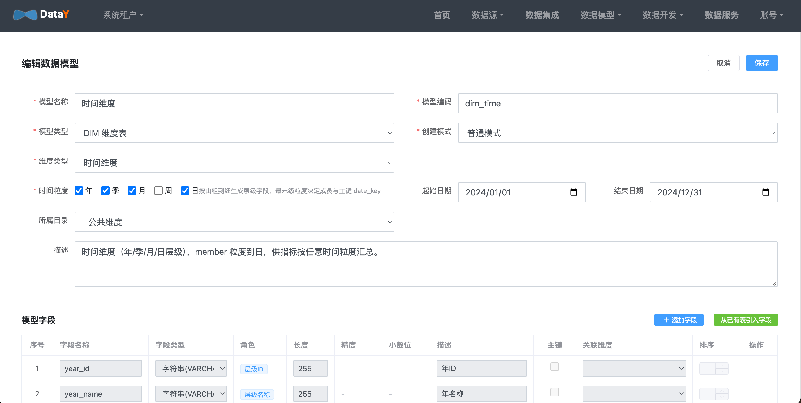
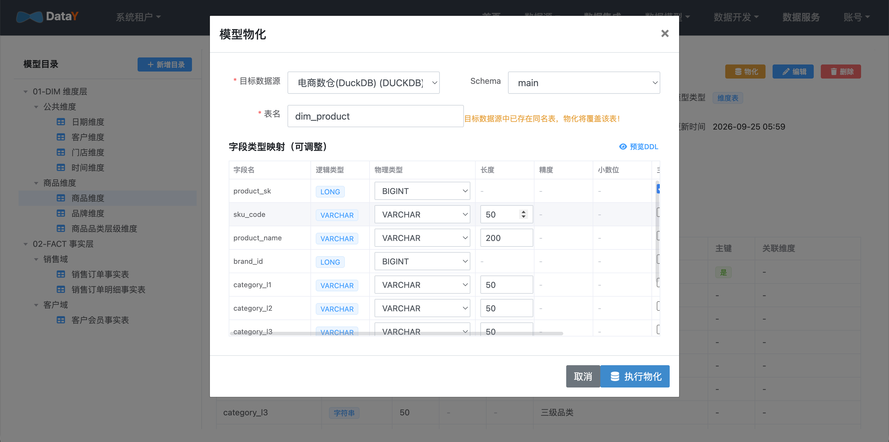
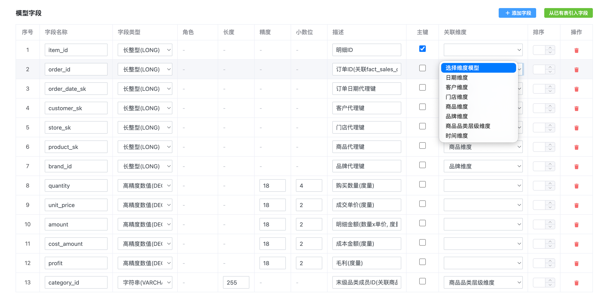

# 维度建模

**目标**：用星型模型定义维度表和事实表的关联关系，让后续指标和问数有业务语义。

导航：**数据模型 → 维度建模**。

## 三种维度类型

创建维度模型时，选对类型能省很多事：

| 类型 | 自动生成什么 | 什么时候用 |
| --- | --- | --- |
| 普通维度 | 基础字段 + `member_id` / `member_name` | 客户、门店、商品 |
| 层级维度 | `level1_id` / `level1_name` … 自动层级字段 | 品类（一级 / 二级 / 三级） |
| 时间维度 | `year` / `month` / `day` 粒度字段 + 预置日期数据 | 按时间趋势分析 |

## 创建维度模型

1. 新建模型，选择维度类型。
2. 普通维度：填写名称、编码等基础字段。
3. 层级维度：按层级数量生成 `levelN_id` / `levelN_name`，可逐级维护成员。
4. 保存后可在列表中查看字段与成员。

## 时间维度

1. 新建模型，类型选 **时间维度**。
2. 勾选粒度：`年 / 季 / 月 / 日`（自动按由粗到细排序）。
3. 填日期范围（如 `2024-01-01 ~ 2024-12-31`）。
4. 保存后自动生成：`year_id` / `month_id` / `day_id` + 主键 `date_key` + 层级路径 `hierarchy`。
5. 点击「物化」→ 勾选「生成预置数据」→ 建表并写入日期数据。

## 事实表关联维度

事实模型用于承载度量，并关联到维度，形成星型模型。

1. 新建事实模型，类型选 `DWD 明细层`。
2. 用「注册模式」从物理表自动导入字段。
3. 对每个外键字段，在「关联维度」列指向对应维度模型。
4. 选一个时间字段作为「时间周期字段」。

示例：`fact_sales_order_item.order_date_sk → dim_date`、`product_sk → dim_product`、`store_sk → dim_store`。

关联完成后，指标与智能问数就能沿维度下钻、按时间聚合。

## 下一步

- [指标管理](guide/metric.md)：基于事实表定义指标口径
- [智能问数](guide/askdata.md)：用自然语言按维度取数
